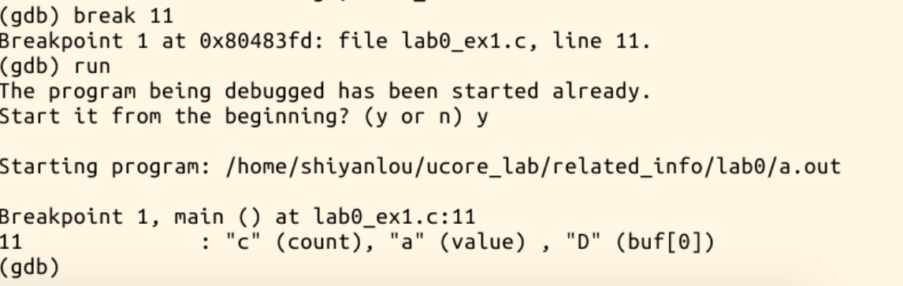

## 实验目的
- 了解操作系统开发实验环境
- 熟悉命令行方式的编译、调试工程
- 掌握基于硬件模拟器的调试技术
- 熟悉C语言编程和指针的概念
- 了解X86汇编语言

## 实验过程
### 使用gcc
参考资料：
	https://gcc.gnu.org/onlinedocs/gcc.pdf
#### 内联汇编的使用
Ucore中用到的是AT&T格式的汇编，与Intel格式在寄存器名命名原则、源/目的操作数顺序、常数立即数的格式、操作数长度标识、寻址方式等方面存在不同。

例如，在寄存器前需要加%，立即数需要加_，源/目的操作数倒置,直接寻址则直接使用变量名，寄存器间接寻址加小括号等

寻址写做：immed32(basepointer,indexpointer,indexscale)

gcc提供了两种内联汇编语句：
1、基本内联汇编语句
2、扩展内联汇编语句
##### 基本内联汇编语句
格式为：

```c
		asm(“statements”);
```
多行语句每一行需要加上“\n\t”,这是为了让gcc将汇编代码翻译成一般的汇编代码时保证换行和留有一定的空格
例如：

```c
	asm( "pushl %eax\n\t"
		  "movl $0,%eax\n\t"
		  "popl %eax"
	);
```
##### 扩展内联汇编语句
格式如下

```c
asm [volatile] ( Assembler Template
   : Output Operands
   [ : Input Operands
   [ : Clobbers ] ])
```

例子：

```c
#define read_cr0() ({ \
    unsigned int __dummy; \
    __asm__( \
        "movl %%cr0,%0\n\t" \
        :"=r" (__dummy)); \
    __dummy; \
})
```

其中，__asm__ 表示汇编代码的开始，"movl %%cr0,%0\n\t"。数字前加前缀 “％“，如％1，％2等表示使用寄存器的样板操作数。可以使用的操作数总数取决于具体CPU中通用寄存器的数 量，如Intel可以有8个。由于这些样板操作数的前缀使用了”％“，因此，在用到具体的寄存器时就在前面加两个“％”，如%%cr0。输出部分（output operand list），用以规定对输出变量（目标操作数）如何与寄存器结合的约束（constraint）,输出部分可以有多个约束，互相以逗号分开。每个约束以“＝”开头，接着用一个字母来表示操作数的类型，然后是关于变量结合的约束。

输出部分：
“＝r”表示相应的目标操作数（指令部分的%0）可以使用任何一个通用寄存器，并且变量__dummy 存放在这个寄存器中。

输入部分：
输入部分与输出部分相似，但没有“＝”。如果输入部分一个操作数所要求使用的寄存器，与前面输出部分某个约束所要求的是同一个寄存器，那就把对应操作数的编号（如“1”，“2”等）放在约束条件中。

修改部分：
这部分常常以“memory”为约束条件，以表示操作完成后内存中的内容已有改变，如果原来某个寄存器的内容来自内存，那么现在内存中这个单元的内容已经改变。

### gcc -Wall
-Wall 选项用于开启编译器常用警告
#### gcc -S

gcc编译上述程序后，生成.s文件，使用cat命令查看，发现，-S选项的作用是将高级语言转化为汇编语言


### 使用gdb
gdb 是功能强大的调试程序，可完成如下的调试任务：
- 设置断点
- 监视程序变量的值
- 程序的单步(step in/step over)执行
- 显示/修改变量的值
- 显示/修改寄存器
- 查看程序的堆栈情况
- 远程调试
- 调试线程
在可以使用 gdb 调试程序之前，必须使用 -g 或 –ggdb编译选项编译源文件。运行 gdb 调试程序时通常使用如下的命令：

```bash
gdb progname
```
在 gdb 提示符处键入help，将列出命令的分类，主要的分类有：

- aliases：命令别名
- breakpoints：断点定义；
- data：数据查看；
- files：指定并查看文件；
- internals：维护命令；
- running：程序执行；
- stack：调用栈查看；
- status：状态查看；
- tracepoints：跟踪程序执行。


用gdb调试lab1

直接运行出现segment fault

gdb进入run后，用where定位并list出源码

在11行设置breakpoint，重新运行，发现程序无错误

然后查看第十一行，分析后得知，程序是在循环赋值，所以D应该放buf
修改后运行正常

		
### 使用makefile
GNU make(简称make)是一种代码维护工具，在大中型项目中，它将根据程序各个模块的更新情况，自动的维护和生成目标代码。

make命令执行时，需要一个 makefile （或Makefile）文件，以告诉make命令需要怎么样的去编译和链接程序

- 如果这个工程没有编译过，那么我们的所有c文件都要编译并被链接。
- 如果这个工程的某几个c文件被修改，那么我们只编译被修改的c文件，并链接目标程序。
- 如果这个工程的头文件被改变了，那么我们需要编译引用了这几个头文件的c文件，并链接目标程序。

只要我们的makefile写得够好，所有的这一切，我们只用一个make命令就可以完成，make命令会自动智能地根据当前的文件修改的情况来确定哪些文件需要重编译，从而自己编译所需要的文件和链接目标程序。

makefile的规则：

```makefile
target ... : prerequisites ...
    command
    ...
    ...
```

target也就是一个目标文件，可以是object file，也可以是执行文件。还可以是一个标签（label）。prerequisites就是，要生成那个target所需要的文件或是目标。command也就是make需要执行的命令（任意的shell命令）。 这是一个文件的依赖关系，也就是说，target这一个或多个的目标文件依赖于prerequisites中的文件，其生成规则定义在 command中。如果prerequisites中有一个以上的文件比target文件要新，那么command所定义的命令就会被执行。这就是makefile的规则。也就是makefile中最核心的内容。
### 使用qemu
QEMU用于模拟一台x86计算机，让ucore能够运行在QEMU上。

格式如：

```bash
qemu [options] [disk_image]
```
其中 disk_image 即硬盘镜像文件。
	
	`-hda file'        `-hdb file' `-hdc file' `-hdd file'
	使用 file  作为硬盘0、1、2、3镜像。
	`-fda file'  `-fdb file'
	使用 file  作为软盘镜像，可以使用 /dev/fd0 作为 file 来使用主机软盘。
	`-cdrom file'
	使用 file  作为光盘镜像，可以使用 /dev/cdrom 作为 file 来使用主机 cd-rom。
	`-boot [a|c|d]'
	从软盘(a)、光盘(c)、硬盘启动(d)，默认硬盘启动。
	`-snapshot'
	写入临时文件而不写回磁盘镜像，可以使用 C-a s 来强制写回。
	`-m megs'
	设置虚拟内存为 msg M字节，默认为 128M 字节。
	`-smp n'
	设置为有 n 个 CPU 的 SMP 系统。以 PC 为目标机，最多支持 255 个 CPU。
	`-nographic'
	禁止使用图形输出。
	其他：
	可用的主机设备 dev 例如：
	vc
	    虚拟终端。
	null
	    空设备
	/dev/XXX
	    使用主机的 tty。
	file: filename
	    将输出写入到文件 filename 中。
	stdio
	    标准输入/输出。
	pipe：pipename
	    命令管道 pipename。
	等。
	使用 dev 设备的命令如：
	`-serial dev'
	    重定向虚拟串口到主机设备 dev 中。
	`-parallel dev'
	    重定向虚拟并口到主机设备 dev 中。
	`-monitor dev'
	    重定向 monitor 到主机设备 dev 中。
	其他参数：
	`-s'
	    等待 gdb 连接到端口 1234。
	`-p port'
	    改变 gdb 连接端口到 port。
	`-S'
	    在启动时不启动 CPU， 需要在 monitor 中输入 'c'，才能让qemu继续模拟工作。
	`-d'
	    输出日志到 qemu.log 文件。
qemu和gdb模拟运行lab1,并分析memset设置断点

### 掌握指针和类型转化相关的C编程
修改lab0_ex3.c。使其可正常运行
运行命令

``` bash
gcc -g -m32 lab0_ex3.c 2>&1|tee make.log
```

得到以下错误：

``` bash
lab0_ex3.c: In function 'main':
lab0_ex3.c:48:5: warning: format '%llx' expects argument of type 'long long unsigned int', but argument 2 has type 'struct gatedesc' [-Wformat=]
     printf("gintr is 0x%llx\n",gintr);
     ^
```

发现gintr是个struct，题目的意思应该是输出对应地址，删掉本句即可


### 掌握通用链表结构相关的Ｃ编程
数据结构课已练习，故略过

