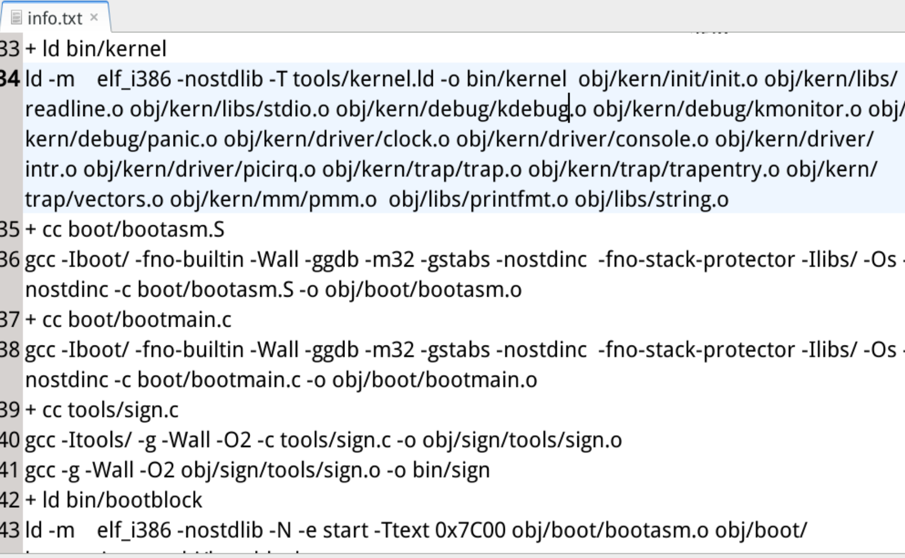
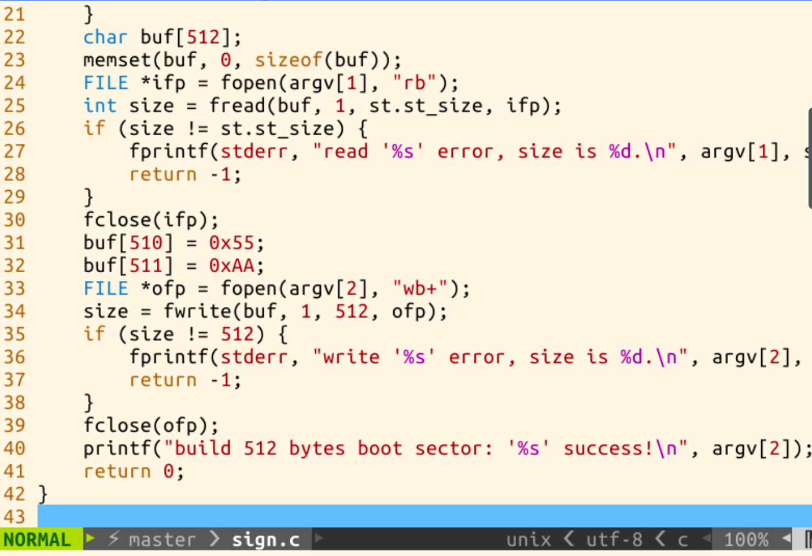
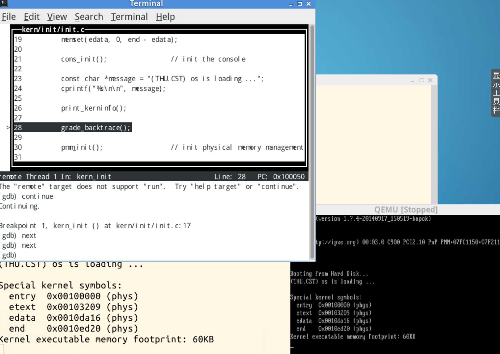
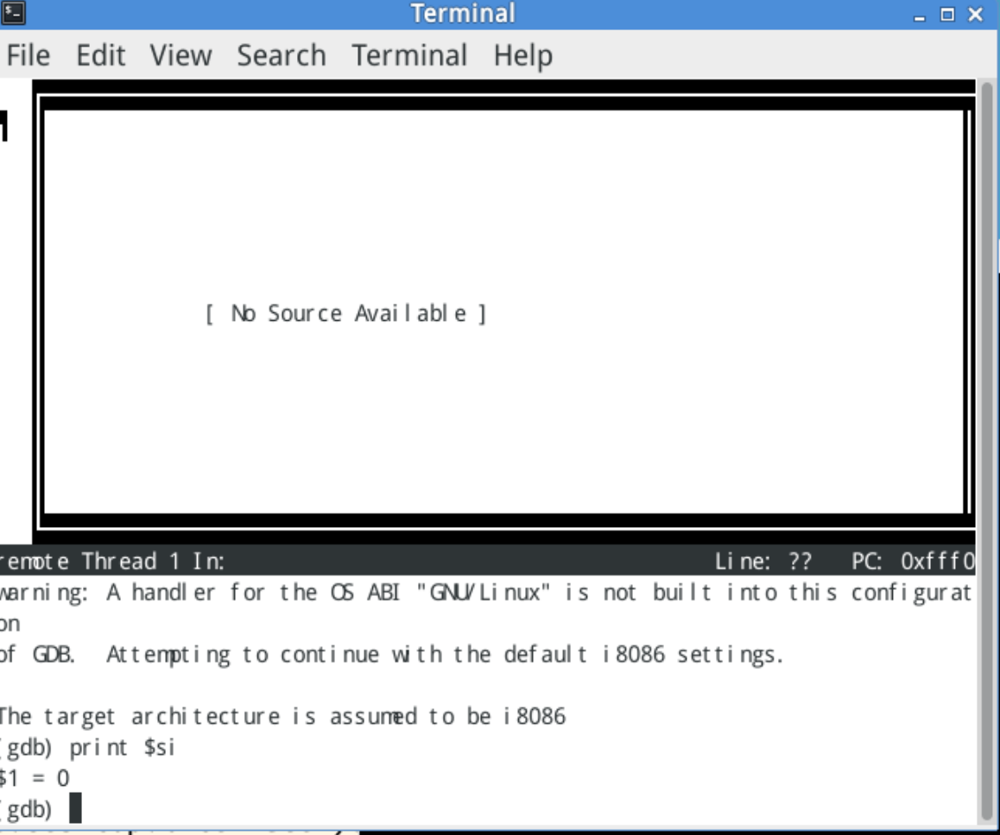
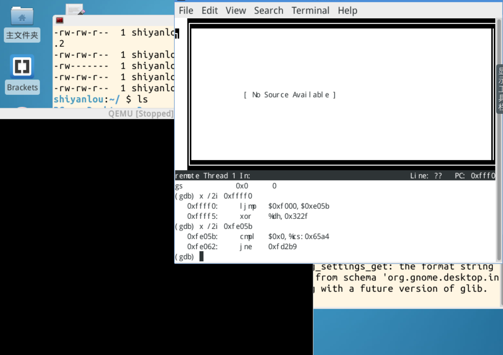
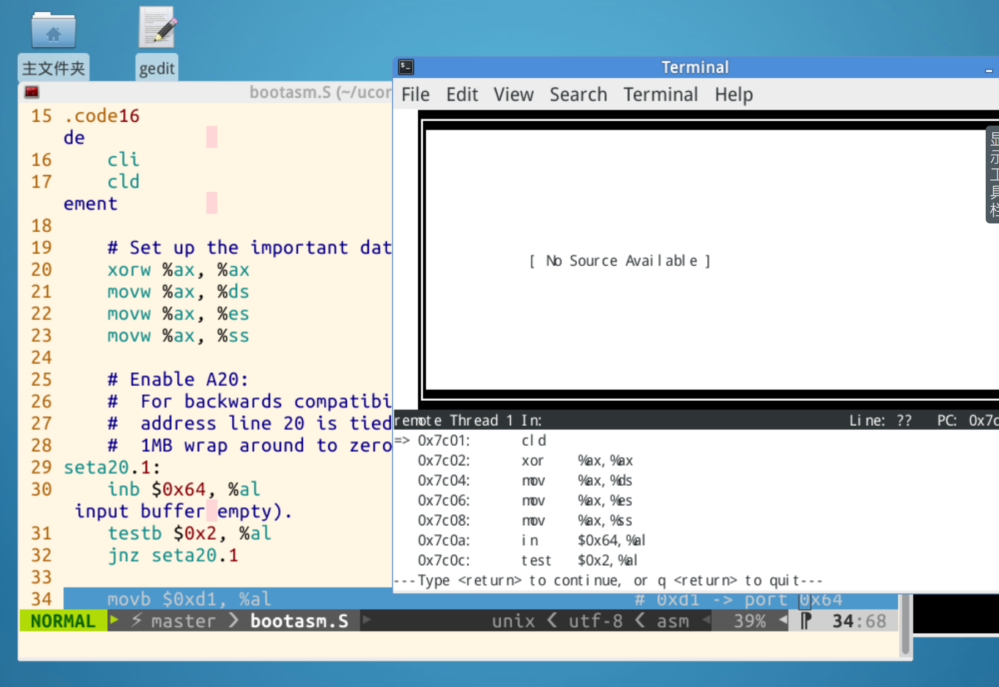
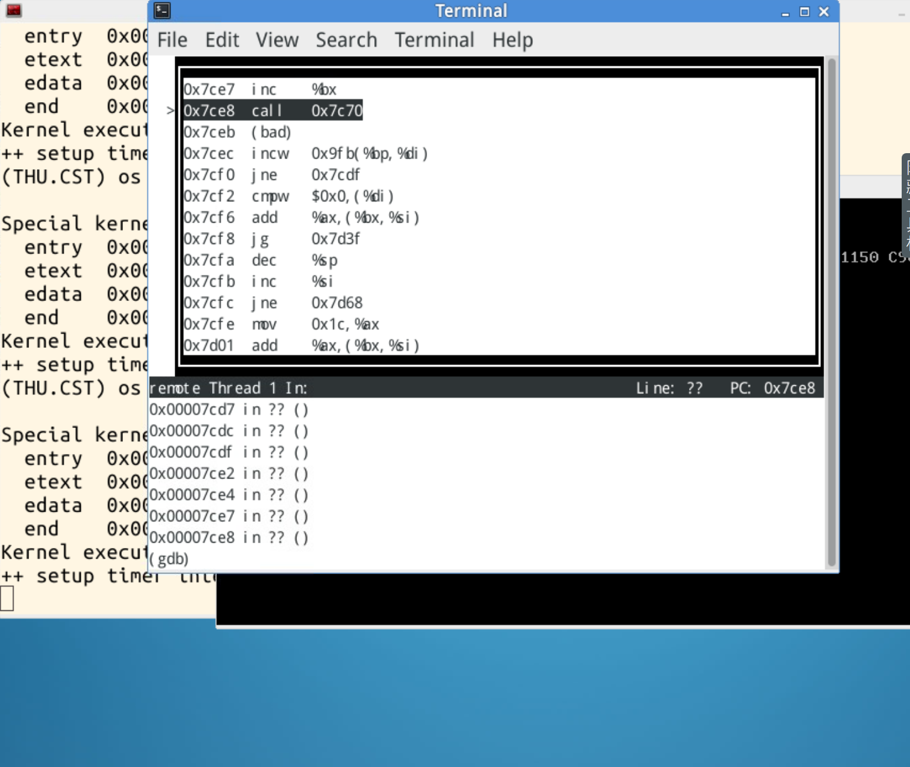
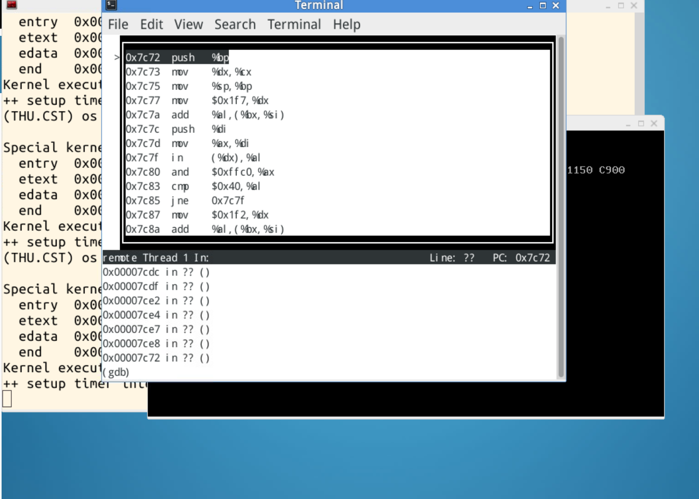
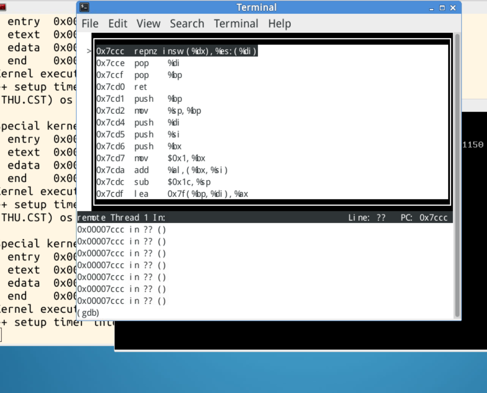

## 实验目的
操作系统是一个软件，也需要通过某种机制加载并运行它。在这里我们将通过另外一个更加简单的软件-bootloader来完成这些工作。为此，我们需要完成一个能够切换到x86的保护模式并显示字符的bootloader，为启动操作系统ucore做准备。lab1提供了一个非常小的bootloader和ucore OS，整个bootloader执行代码小于512个字节，这样才能放到硬盘的主引导扇区中。通过分析和实现这个bootloader和ucore OS，我们的目的在于了解到：

### 计算机原理

- CPU的编址与寻址: 基于分段机制的内存管理
- CPU的中断机制
- 外设：串口/并口/CGA，时钟，硬盘

### Bootloader软件

- 编译运行bootloader的过程
- 调试bootloader的方法
- PC启动bootloader的过程
- ELF执行文件的格式和加载
- 外设访问：读硬盘，在CGA上显示字符串

### ucore OS软件
- 编译运行ucore OS的过程
- ucore OS的启动过程
- 调试ucore OS的方法
- 函数调用关系：在汇编级了解函数调用栈的结构和处理过程
- 中断管理：与软件相关的中断处理
- 外设管理：时钟

## 实验步骤
### 练习1 理解通过make生成执行文件的过程。
#### 要解决的问题：

- 操作系统镜像文件ucore.img是如何一步一步生成的？(需要比较详细地解释Makefile中每一条相关命令和命令参数的含义，以及说明命令导致的结果)
- 一个被系统认为是符合规范的硬盘主引导扇区的特征是什么？

在lab1下执行make


生成 bin文件夹和 obj文件夹
#### ucore.img
打开Makefile，首先找到生成ucore.img的位置：

```makefile
# create ucore.img
UCOREIMG	:= $(call totarget,ucore.img)

$(UCOREIMG): $(kernel) $(bootblock)
	$(V)dd if=/dev/zero of=$@ count=10000
	$(V)dd if=$(bootblock) of=$@ conv=notrunc
	$(V)dd if=$(kernel) of=$@ seek=1 conv=notrunc

$(call create_target,ucore.img)
```
\# 为注释,第一句定义了变量UCOREIMG 调用了call函数，将ucore.img传入totarget表达式得到。
然后开始定义UCOREIMG的生成依赖，UCOREIMG依赖于两个文件一个是kernel，一个是bootblock。

接着下面给出了链接两个文件的方式，使用了dd命令，从标准输入到标准输出拷贝一个文件并有规律的转化

- $@表示规则中的目标文件集。
- ‘if=file’ 代表用文件输入代替标准输入
- ‘of=file’ 代表用文件输出代替标准输出，除非设置‘conv=notrunc’ 否则dd会进行0字节截断，或者按照‘seek=’的大小
- ‘count=n’ 代表从输入文件中拷贝n个大小为ibs byte的块
- ‘ibs=bytes’ 设置输入块大小，默认为512字节，这会确定dd从每块读多少字节
- ‘conv=conversion[,conversion]…’ 将文件按照指定参数转化，其中notrunc为：不截断输出文件，
- ‘seek=n’ 在拷贝前输出文件时跳过n 个‘obs’-byte的块。
- ‘obs=bytes’ 设置输出块大小，默认为512字节，这会确定dd从每块写多少字节
- 更多内容：https://www.gnu.org/software/coreutils/manual/html_node/dd-invocation.html

解释一下为，首先从/dev/zero中读了10000*512块的空字节，然后生成空文件，接着将bootblock中的内容拷贝到目标文件，然后从输出文件的512字节后继续写入kernel的内容

最后调用call函数使用了create_target表达式

#### kernel
```makefile
# create kernel target
kernel = $(call totarget,kernel)

$(kernel): tools/kernel.ld

$(kernel): $(KOBJS)
	@echo + ld $@
	$(V)$(LD) $(LDFLAGS) -T tools/kernel.ld -o $@ $(KOBJS)
	@$(OBJDUMP) -S $@ > $(call asmfile,kernel)
	@$(OBJDUMP) -t $@ | $(SED) '1,/SYMBOL TABLE/d; s/ .* / /; /^$$/d' > $(call symfile,kernel)

$(call create_target,kernel)

```

kernel的生成依赖于KOBJS和tools/kernel.ld，生成命令依赖于
i386-elf-objdump 、ld和objdump等。

使用

```shell
make "V=" > 1.txt 
```
查看链接详情

可以看到其依赖的所有文件
单个文件编译gcc命令如下：

```shell
gcc -Iboot/ -fno-builtin -Wall -ggdb -m32 -gstabs -nostdinc  -fno-stack-protector -Ilibs/ -Os -nostdinc -c boot/bootasm.S -o obj/boot/bootasm.o
```

参数解释为：

- -Iboot/-Ilibs/:找名为boot/的头文件目录
- fno-builtin :不使用C语言的内建函数
- -Wall:开启编译警告
- -ggdb:产生 GDB 所需的调试信息。这意味着将会使用可用的、最具表达力的格式（DWARF 2 、stabs ，或者在前两者不支持情况下的其他本地格式），如果可能的话还会包含 GDB 扩展信息。
- -m32:生成32位机器的汇编代码；
- -gstabs:此选项以stabs格式声称调试信息,但是不包括gdb调试信息. 
-  -nostdinc:不要在标准系统目录中寻找头文件.只搜索`-I'选项指定的目录(以及当前目录,如果合适).结合使用`-nostdinc'和`-I-'选项,你可以把包含文件搜索限制在显式指定的目录.
-  -fno-stack-protector禁用栈保护措施
-  -Os:相当于-O2.5。是使用了所有-O2的优化选项，但又不缩减代码尺寸的方法。
-  -c:表示只编译源文件但不链接


#### bootblock
```makefile
# create bootblock
bootfiles = $(call listf_cc,boot)
$(foreach f,$(bootfiles),$(call cc_compile,$(f),$(CC),$(CFLAGS) -Os -nostdinc))

bootblock = $(call totarget,bootblock)

$(bootblock): $(call toobj,$(bootfiles)) | $(call totarget,sign)
	@echo + ld $@
	$(V)$(LD) $(LDFLAGS) -N -e start -Ttext 0x7C00 $^ -o $(call toobj,bootblock)
	@$(OBJDUMP) -S $(call objfile,bootblock) > $(call asmfile,bootblock)
	@$(OBJCOPY) -S -O binary $(call objfile,bootblock) $(call outfile,bootblock)
	@$(call totarget,sign) $(call outfile,bootblock) $(bootblock)

$(call create_target,bootblock)

```
bootblock 依赖于bootasm.o、bootmain.o、sign
生成bootblock的编译指令为：

```shell
ld -m    elf_i386 -nostdlib -N -e start -Ttext 0x7C00 obj/boot/bootasm.o obj/boot/bootmain.o -o obj/bootblock.o
```
其中关键的参数为

- 	-m <emulation>  模拟为i386上的连接器
-  	-nostdlib  不使用标准库
-   -N  设置代码段和数据段均可读写
-   -e <entry>  指定入口
-   -Ttext  制定代码段开始位置
-  -fno-builtin:除非用__builtin_前缀，否则不进行builtin函数的优化

最后拷贝二进制代码bootblock.o到bootblock.out,用使用sign工具处理bootblock.out，生成bootblock

```shell
objcopy -S -O binary obj/bootblock.o obj/bootblock.out
```
其中关键的参数为:

- -S  移除所有符号和重定位信息
- 	-O <bfdname>  指定输出格式

#### 一个被系统认为是符合规范的硬盘主引导扇区的特征是什么？
从sign.c的代码来看，一个磁盘主引导扇区只有512字节。且第510个（倒数第二个）字节是0x55，第511个（倒数第一个）字节是0xAA。

### 练习2
进行如下练习

- 从CPU加电后执行的第一条指令开始，单步跟踪BIOS的执行。
- 在初始化位置0x7c00设置实地址断点,测试断点正常。
- 从0x7c00开始跟踪代码运行,将单步跟踪反汇编得到的代码与bootasm.S和 bootblock.asm进行比较。
- 自己找一个bootloader或内核中的代码位置，设置断点并进行测试。

1 修改 lab1/tools/gdbinit,内容为:

```makefile
set architecture i8086
target remote :1234
define hook-stop
x/i $pc
end
```
命令行运行make debug，可以进行调试


可以发现启动后第一条指令地址：


要用到的gdb指令

```shell
(gdb) i r
(gdb) i r a                     # 查看所有寄存器（包括浮点、多媒体）
(gdb) i r esp
(gdb) i r pc
(gdb) x /wx 0x80040000    # 以16进制显示指定地址处的数据
(gdb) x /8x $esp
(gdb) x /16x $esp+12
(gdb) x /16s 0x86468700   # 以字符串形式显示指定地址处的数据
(gdb) x /24i 0x8048a51      # 以指令形式显示指定地址处的数据（24条）
(gdb) b *0x80400000 #断点
(gdb) watch *(unsigned int *)0xbffff400==0x90909090 #监测点
```

EIP 的内容为：
0xF000 
CS 的内容为：
0xFFF0H

所以第一条指令地址：
F000*16 + FFF0H = FFFF0H


可以看到，第一条指令为无条件跳转，跳转到F000*16+E05B = FE05B处继续执行BIOS

在tools/下的gdbinit 中添加下列语句

```shell
b *0x7c00 #在0x7c00打断点
continue	#继续执行代码
x /10i $pc	#查看当前要执行的十个代码
```

重新运行make debug 后，在0x7c00处中断，并显示附近指令
vim打开bootasm.S 用/查找

可以发现，bootloader此处反汇编出的代码与bootasm.S处的代码相同

通过gdb下si指令，可以单步执行该代码

### 练习3

```c
定义一个全局名字start
.globl start
start:
CPU刚启动为16位模式
  .code16                     # Assemble for 16-bit mode
关中断
  cli                         # Disable interrupts
清方向标志
  cld                         # String operations increment
 
  # Set up the important data segment registers (DS, ES, SS).
设置重要的数据段寄存器
ax清零
  xorw    %ax,%ax             # Segment number zero
ds清零
  movw    %ax,%ds             # -> Data Segment
es清零
  movw    %ax,%es             # -> Extra Segment
ss清零
  movw    %ax,%ss             # -> Stack Segment


```

- 首先进行初始化操作，关中断并且将段寄存器置零
- cli中断标志置0，cld方向标志位置0

```c
  # Enable A20:
  #   For backwards compatibility with the earliest PCs, physical
  #   address line 20 is tied low, so that addresses higher than
  #   1MB wrap around to zero by default.  This code undoes this.
打开A20地址线
为了兼容早期的PC机，第20根地址线在实模式下不能使用
所以超过1MB的地址，默认就会返回到地址0，重新从0循环计数，
下面的代码打开A20地址线
 
seta20.1:
从0x64端口读入一个字节的数据到al中
  inb     $0x64,%al               # Wait for not busy
test指令可以当作and指令，只不过它不会影响操作数
  testb   $0x2,%al
如果上面的测试中发现al的第2位为0，就不执行该指令
否则就循环检查
  jnz     seta20.1
 
将0xd1写入到al中
  movb    $0xd1,%al               # 0xd1 -> port 0x64
将al中的数据写入到端口0x64中
  outb    %al,$0x64
 
seta20.2:
从0x64端口读取一个字节的数据到al中
  inb     $0x64,%al               # Wait for not busy
测试al的第2位是否为0
  testb   $0x2,%al
如果上面的测试中发现al的第2位为0，就不执行该指令
否则就循环检查
  jnz     seta20.2
 
将0xdf写入到al中
  movb    $0xdf,%al               # 0xdf -> port 0x60
将al中的数据写入到0x60端口中
  outb    %al,$0x60

```
- inb 从I/O端口读取一个字节(BYTE, HALF-WORD) ;
- outb 向I/O端口写入一个字节（BYTE, HALF-WORD） ;

```c
将全局描述符表描述符加载到全局描述符表寄存器
  lgdt    gdtdesc
```

加载全局描述符寄存器gdtr，通过lgdt指令将全局描述符入口地址装入gdtr寄存器中

```c
cr0中的第0位为1表示处于保护模式
cr0中的第0位为0，表示处于实模式
把控制寄存器cr0加载到eax中
  movl    %cr0, %eax
将eax中的第0位设置为1
  orl     $CR0_PE_ON, %eax
将eax中的值装入cr0中
  movl    %eax, %cr0

```

进入保护模式，将CR0寄存器最低位PE置1
可以看到进入保护模式一共进行了四个步骤

1. 初始化操作
2. 开启A20
3. 加载gdt
4. CR0寄存器最低位PE置1

```c
跳转到32位模式中的下一条指令
将处理器切换为32位工作模式
下面这条指令执行的结果会将$PROT_MODE_CSEG加载到cs中，cs对应的高速缓冲存储器会加载代码段描述符
同样将$protcseg加载到ip中
  ljmp    $PROT_MODE_CSEG, $protcseg

```
长跳转指令ljmp \$PROT_MODE_CSEG, \$protcseg跳转到下一条代码，目的是跳过剩余的16位指令。此处新的GDT已经发挥作用，seg= PROT_MODE_CSEG, offset=protcseg，因为CSEG的基地址为0，则程序跳转到了代码段的protcseg偏移处

```c
  .code32                     # Assemble for 32-bit mode
protcseg:
  # Set up the protected-mode data segment registers
设置保护模式下的数据寄存器
将数据段选择子装入到ax中
  movw    $PROT_MODE_DSEG, %ax    # Our data segment selector
将ax装入到其他数据段寄存器中，在装入的同时，
数据段描述符会自动的加入到这些段寄存器对应的高速缓冲寄存器中
  movw    %ax, %ds                # -> DS: Data Segment
  movw    %ax, %es                # -> ES: Extra Segment
  movw    %ax, %fs                # -> FS
  movw    %ax, %gs                # -> GS
  movw    %ax, %ss                # -> SS: Stack Segment
  
  # Set up the stack pointer and call into C.
设置栈指针，并且调用c函数
  movl    $start, %esp
调用main.c中的bootmain函数
  call bootmain
 
  # If bootmain returns (it shouldn't), loop.
如果bootmain返回的话，就一直循环
spin:
  jmp spin

```
设置段寄存器，并建立堆栈,进入boot主方法


### 练习4
通过阅读bootmain.c，了解bootloader如何加载ELF文件。通过分析源代码和通过qemu来运行并调试bootloader&OS
bootloader如何读取硬盘扇区的？
bootloader是如何加载ELF格式的OS

#### 使用gdb+qemu追踪bootmain
在练习3的最后可以看到，进入保护模式后，就调用了bootmain，我们使用gdb+qemu追踪这个过程
首先 bootmain.c源码如下：

```c
#include <defs.h>
#include <x86.h>
#include <elf.h>

/* *********************************************************************
 * This a dirt simple boot loader, whose sole job is to boot
 * an ELF kernel image from the first IDE hard disk.
 *
 * DISK LAYOUT
 *  * This program(bootasm.S and bootmain.c) is the bootloader.
 *    It should be stored in the first sector of the disk.
 *
 *  * The 2nd sector onward holds the kernel image.
 *
 *  * The kernel image must be in ELF format.
 *
 * BOOT UP STEPS
 *  * when the CPU boots it loads the BIOS into memory and executes it
 *
 *  * the BIOS intializes devices, sets of the interrupt routines, and
 *    reads the first sector of the boot device(e.g., hard-drive)
 *    into memory and jumps to it.
 *
 *  * Assuming this boot loader is stored in the first sector of the
 *    hard-drive, this code takes over...
 *
 *  * control starts in bootasm.S -- which sets up protected mode,
 *    and a stack so C code then run, then calls bootmain()
 *
 *  * bootmain() in this file takes over, reads in the kernel and jumps to it.
 * */

#define SECTSIZE        512
#define ELFHDR          ((struct elfhdr *)0x10000)      // scratch space

/* waitdisk - wait for disk ready */
static void
waitdisk(void) {
    while ((inb(0x1F7) & 0xC0) != 0x40)
        /* do nothing */;
}

/* readsect - read a single sector at @secno into @dst */
static void
readsect(void *dst, uint32_t secno) {
    // wait for disk to be ready
    waitdisk();

    outb(0x1F2, 1);                         // count = 1
    outb(0x1F3, secno & 0xFF);
    outb(0x1F4, (secno >> 8) & 0xFF);
    outb(0x1F5, (secno >> 16) & 0xFF);
    outb(0x1F6, ((secno >> 24) & 0xF) | 0xE0);
    outb(0x1F7, 0x20);                      // cmd 0x20 - read sectors

    // wait for disk to be ready
    waitdisk();

    // read a sector
    insl(0x1F0, dst, SECTSIZE / 4);
}

/* *
 * readseg - read @count bytes at @offset from kernel into virtual address @va,
 * might copy more than asked.
 * */
static void
readseg(uintptr_t va, uint32_t count, uint32_t offset) {
    uintptr_t end_va = va + count;

    // round down to sector boundary
    va -= offset % SECTSIZE;

    // translate from bytes to sectors; kernel starts at sector 1
    uint32_t secno = (offset / SECTSIZE) + 1;

    // If this is too slow, we could read lots of sectors at a time.
    // We'd write more to memory than asked, but it doesn't matter --
    // we load in increasing order.
    for (; va < end_va; va += SECTSIZE, secno ++) {
        readsect((void *)va, secno);
    }
}

/* bootmain - the entry of bootloader */
void
bootmain(void) {
    // read the 1st page off disk
    readseg((uintptr_t)ELFHDR, SECTSIZE * 8, 0);

    // is this a valid ELF?
    if (ELFHDR->e_magic != ELF_MAGIC) {
        goto bad;
    }

    struct proghdr *ph, *eph;

    // load each program segment (ignores ph flags)
    ph = (struct proghdr *)((uintptr_t)ELFHDR + ELFHDR->e_phoff);
    eph = ph + ELFHDR->e_phnum;
    for (; ph < eph; ph ++) {
        readseg(ph->p_va & 0xFFFFFF, ph->p_memsz, ph->p_offset);
    }

    // call the entry point from the ELF header
    // note: does not return
    ((void (*)(void))(ELFHDR->e_entry & 0xFFFFFF))();

bad:
    outw(0x8A00, 0x8A00);
    outw(0x8A00, 0x8E00);

    /* do nothing */
    while (1);
}
```
操作学习：
gdb layout

- layout regs
- layout asm
- ctrl+l 刷新窗口
- winheight name +/-line 调整窗口大小
- ctrl+x+(1/2/a)切换窗口模式
- layout src：显示源代码窗口
- layout split：显示源代码和汇编窗口


通过si单步追踪，进入bootmain，地址0x7c70

最后程序在


0x7ccc 处进入死循环，即bootmain中的

```c
    while (1);
```

#### readsect函数
用于加载一个扇区的内容到指定的内存中，读取的过程大致为：(1)等待磁盘准备好；(2)发出读取扇区的命令，通过访问IO地址寄存器0x1f0~0x1f7实现；(3)等待磁盘准备好；(4)把磁盘扇区读取到指定内存中。

```c
static void
	readsect(void *dst, uint32_t secno) {
	    waitdisk();
	
	    outb(0x1F2, 1);                         // 设置读取扇区的数目为1
	    outb(0x1F3, secno & 0xFF);
	    outb(0x1F4, (secno >> 8) & 0xFF);
	    outb(0x1F5, (secno >> 16) & 0xFF);
	    outb(0x1F6, ((secno >> 24) & 0xF) | 0xE0);
	        // 上面四条指令联合制定了扇区号
	        // 在这4个字节线联合构成的32位参数中
	        //   29-31位强制设为1
	        //   28位(=0)表示访问"Disk 0"
	        //   0-27位是28位的偏移量
	    outb(0x1F7, 0x20);                      // 0x20命令，读取扇区
	
	    waitdisk();

	    insl(0x1F0, dst, SECTSIZE / 4);         // 读取到dst位置，
	                                            // 幻数4因为这里以DW为单位
	}
```
#### readseg函数
这个函数的作用是从ELF文件偏移为offset处，读取count个字节到内存地址为va处

```c
static void
	readseg(uintptr_t va, uint32_t count, uint32_t offset) {
	    uintptr_t end_va = va + count;
	
	    va -= offset % SECTSIZE;
	
	    uint32_t secno = (offset / SECTSIZE) + 1; 
	    // 加1因为0扇区被引导占用
	    // ELF文件从1扇区开始
	
	    for (; va < end_va; va += SECTSIZE, secno ++) {
	        readsect((void *)va, secno);
	    }
	}
```

#### bootmain函数
首先将硬盘上从第一个扇区开始的4096个字节读到内存中地址为0x10000处，然后检查ELF文件是否合法，并找到程序段的起始地址，读取内核程序到内存中，最后执行内核程序

```c
void bootmain(void) {
	    // 首先读取ELF的头部
	    readseg((uintptr_t)ELFHDR, SECTSIZE * 8, 0);
	
	    // 通过储存在头部的幻数判断是否是合法的ELF文件
	    if (ELFHDR->e_magic != ELF_MAGIC) {
	        goto bad;
	    }
	
	    struct proghdr *ph, *eph;
	
	    // ELF头部有描述ELF文件应加载到内存什么位置的描述表，
	    // 先将描述表的头地址存在ph
	    ph = (struct proghdr *)((uintptr_t)ELFHDR + ELFHDR->e_phoff);
	    eph = ph + ELFHDR->e_phnum;
	
	    // 按照描述表将ELF文件中数据载入内存
	    for (; ph < eph; ph ++) {
	        readseg(ph->p_va & 0xFFFFFF, ph->p_memsz, ph->p_offset);
	    }
	    // ELF文件0x1000位置后面的0xd1ec比特被载入内存0x00100000
	    // ELF文件0xf000位置后面的0x1d20比特被载入内存0x0010e000

	    // 根据ELF头部储存的入口信息，找到内核的入口
	    ((void (*)(void))(ELFHDR->e_entry & 0xFFFFFF))();
	
	bad:
	    outw(0x8A00, 0x8A00);
	    outw(0x8A00, 0x8E00);
	    while (1);
	}
```
### 练习5
### 练习6