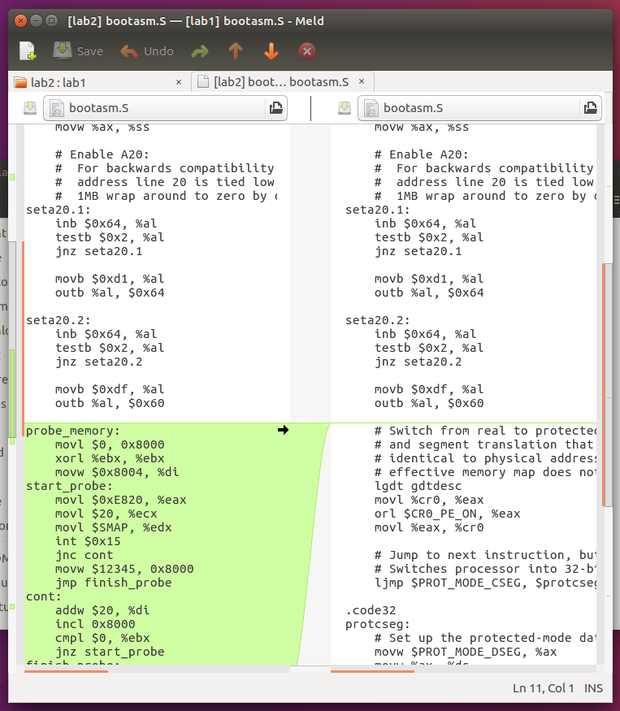
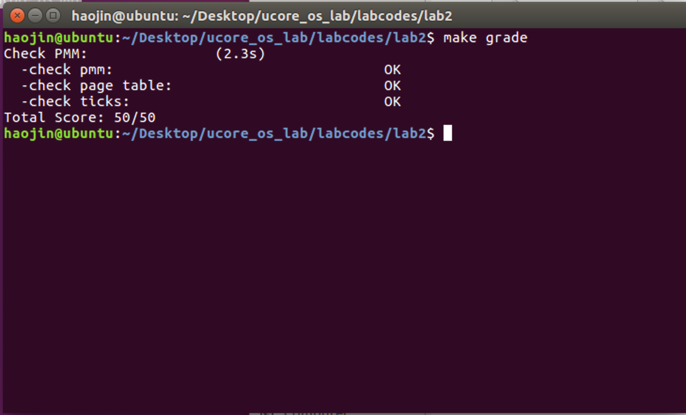

## 实验目的

- 理解基于段页式内存地址的转换机制
- 理解页表的建立和使用方法
- 理解物理内存的管理方法

## 练习0
本实验依赖实验1。请把你做的实验1的代码填入本实验中代码中有“LAB1”的注释相应部分。提示：可采用diff和patch工具进行半自动的合并（merge），也可用一些图形化的比较/merge工具来手动合并，比如meld，eclipse中的diff/merge工具，understand中的diff/merge工具等。


使用meld工具 很轻松的可以完成代码合并任务


## 练习1 实现 first-fit 连续物理内存分配算法

list.h 中已实现方法：

```c
static inline void list_init(list_entry_t *elm) __attribute__((always_inline));
static inline void list_add(list_entry_t *listelm, list_entry_t *elm) __attribute__((always_inline));
static inline void list_add_before(list_entry_t *listelm, list_entry_t *elm) __attribute__((always_inline));
static inline void list_add_after(list_entry_t *listelm, list_entry_t *elm) __attribute__((always_inline));
static inline void list_del(list_entry_t *listelm) __attribute__((always_inline));
static inline void list_del_init(list_entry_t *listelm) __attribute__((always_inline));
static inline bool list_empty(list_entry_t *list) __attribute__((always_inline));
static inline list_entry_t *list_next(list_entry_t *listelm) __attribute__((always_inline));
static inline list_entry_t *list_prev(list_entry_t *listelm) __attribute__((always_inline));

static inline void __list_add(list_entry_t *elm, list_entry_t *prev, list_entry_t *next) __attribute__((always_inline));
static inline void __list_del(list_entry_t *prev, list_entry_t *next) __attribute__((always_inline));
```

Page定义在memlayout.h中，如下：

```c
struct Page {
    int ref;                        // page frame's reference counter
    uint32_t flags;                 // array of flags that describe the status of the page frame
    unsigned int property;          // the num of free block, used in first fit pm manager
    list_entry_t page_link;         // free list link
};
```
实现最先适应算法：


```c

static void
default_init(void) {
    list_init(&free_list);
    nr_free = 0;
}


static void
default_init_memmap(struct Page *base, size_t n) {
    assert(n > 0);
    struct Page *p = base;
    for (; p != base + n; p ++) {
        assert(PageReserved(p)); 
	SetPageReserved(p);
        p->property = 0;  
        set_page_ref(p, 0);
    }
    base->property = n;         
    SetPageProperty(base);
    nr_free += n;
    list_add(&free_list, &(base->page_link));
}
```

```c
//判断空闲地址空间是否大于所需空间
//从free_list开始，遍历链表，直到找到第一块不小于所需空间大小的内存块
//分配连续的n页，修改标志位
//从链表中删除此内存块，如果有剩余的小的内存块，重新插入链表
static struct Page *
default_alloc_pages(size_t n) {
    assert(n > 0);
    if (n > nr_free) {
        return NULL;
    }
    struct Page *page = NULL;
    list_entry_t *le = &free_list;
    while ((le = list_next(le)) != &free_list) {
        struct Page *p = le2page(le, page_link);
        if (p->property >= n) {
            page = p;
            break;
        }
    }
    if (page != NULL) {
        list_del(&(page->page_link));
        if (page->property > n) {
            struct Page *p = page + n;
            p->property = page->property - n;
            list_add(&free_list, &(p->page_link));
    }
	list_del(&(page->page_link),&(p->page_link));
        nr_free -= n;
        ClearPageProperty(page);
    }
    return page;
}
```

```c
//修改释放页的标志位
//找到链表中应该插入的位置并插入
//判断此块空余空间能否与前后空余空间合并，如果可以将其合并
static void
default_free_pages(struct Page *base, size_t n) {
    assert(n > 0);
    struct Page *p = base;
    for (; p != base + n; p ++) {
        assert(!PageReserved(p) && !PageProperty(p));
        p->flags = 0;
        set_page_ref(p, 0);
    }
    base->property = n;
    SetPageProperty(base);
    list_entry_t *le = list_next(&free_list);
    while (le != &free_list) {
        p = le2page(le, page_link);
        le = list_next(le);
        if (base + base->property == p) {
            base->property += p->property;
            ClearPageProperty(p);
            list_del(&(p->page_link));
        }
        else if (p + p->property == base) {
            p->property += base->property;
            ClearPageProperty(base);
            base = p;
            list_del(&(p->page_link));
        }
    }
    nr_free += n;
    le = list_next(&free_list);
    while (le != &free_list) {
        p = le2page(le, page_link);
        if (base + base->property <= p) {
            break;
        }
        le = list_next(le);
    }
    list_add(&free_list, &(base->page_link));
}
```
## 练习2 实现寻找虚拟地址对应的页表项

通过设置页表和对应的页表项，可建立虚拟内存地址和物理内存地址的对应关系。其中的get_pte函数是设置页表项环节中的一个重要步骤。此函数找到一个虚地址对应的二级页表项的内核虚地址，如果此二级页表项不存在，则分配一个包含此项的二级页表。

- 请描述页目录项（Pag Director Entry）和页表（Page Table Entry）中每个组成部分的含 义和以及对ucore而言的潜在用处

	页的分配是以物理页为单位的，其地址要求按照页大小，即4096字节对齐。PDE和PTE的高20位用于保存对应页表和页的基地址，低12位可以用作表项的标志位，对表项的属性进行说明，如是否存在，是否可写以及访问权限等。

- 如果ucore执行过程中访问内存，出现了页访问异常，请问硬件要做哪些事情？

	进行换页操作 首先 CPU 将产生页访问异常的线性地址 放到 cr2 寄存器中 
	然后就是和普通的中断一样 保护现场 将寄存器的值压入栈中 
	然后压入 error_code 中断服务例程将外存的数据换到内存中来 
	最后 退出中断 回到进入中断前的状态

```c
    pde_t *pdep = &pgdir[PDX(la)]; 
    if (!(*pdep & PTE_P)) {         
        struct Page* page = alloc_page();
        if (!create || page == NULL) {
            return NULL;
        }
        set_page_ref(page, 1);
        uintptr_t pa = page2pa(page);
        memset(KADDR(pa), 0, PGSIZE); 
        *pdep = pa | PTE_U | PTE_W | PTE_P; 
    }
    return &((pte_t *)KADDR(PDE_ADDR(*pdep)))[PTX(la)];
```
- 根据虚地址的高十位查询页目录，找到页表项的pdep
- 检查该页是否在内存中，如果不在，创建该页，并更新相关信息
- 根据虚拟地址的中间十位，找到虚拟地址对应的页表项

## 练习3
当释放一个包含某虚地址的物理内存页时，需要让对应此物理内存页的管理数据结构Page做相关的清除处理，使得此物理内存页成为空闲；另外还需把表示虚地址与物理地址对应关系的二级页表项清除。

```c
static inline void
page_remove_pte(pde_t *pgdir, uintptr_t la, pte_t *ptep) {
if (*ptep & PTE_P) {                    //判断页表中该表项是否存在
    struct Page *page = pte2page(*ptep);
    if (page_ref_dec(page) == 0) {      //判断是否只被引用了一次
        free_page(page);                //如果只被引用了一次，那么可以释放掉此页
    }
    *ptep = 0;                          //如果被多次引用，则不能释放此页，只用释放二级页表的表项
    tlb_invalidate(pgdir, la);          //更新页表
    }
}
```

## 实验结果



