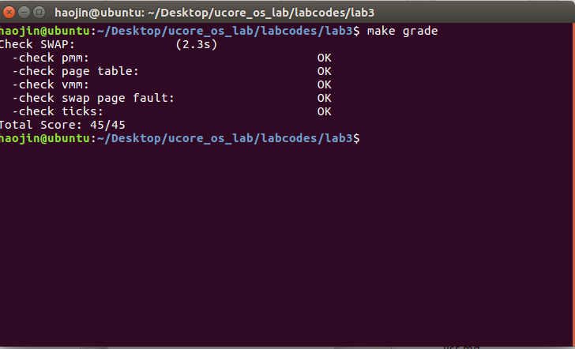

## 实验目的
- 了解虚拟内存的Page Fault异常处理实现
- 了解页替换算法在操作系统中的实现

## 实验内容
本次实验是在实验二的基础上，借助于页表机制和实验一中涉及的中断异常处理机制，完成Page Fault异常处理和FIFO页替换算法的实现，结合磁盘提供的缓存空间，从而能够支持虚存管理，提供一个比实际物理内存空间“更大”的虚拟内存空间给系统使用。这个实验与实际操作系统中的实现比较起来要简单，不过需要了解实验一和实验二的具体实现。实际操作系统系统中的虚拟内存管理设计与实现是相当复杂的，涉及到与进程管理系统、文件系统等的交叉访问。如果大家有余力，可以尝试完成扩展练习，实现extended　clock页替换算法。

### 练习0：填写已有实验

与lab2相同，使用meld快速合并

### 练习1：给未被映射的地址映射上物理页（需要编程）
完成do_pgfault（mm/vmm.c）函数，给未被映射的地址映射上物理页。设置访问权限 的时候需要参考页面所在 VMA 的权限，同时需要注意映射物理页时需要操作内存控制 结构所指定的页表，而不是内核的页表。注意：在LAB3 EXERCISE 1处填写代码。执行

```shell
make　qemu
或者
make grade
```

```c
ptep = get_pte(mm->pgdir, addr, 1); // 根据引发缺页异常的地址 去找到 地址所对应的 PTE 如果找不到 则创建一页表
    if (*ptep == 0) { // PTE 所指向的 物理页表地址 若不存在 则分配一物理页并将逻辑地址和物理地址作映射 (就是让 PTE 指向 物理页帧)
        if (pgdir_alloc_page(mm->pgdir, addr, perm) == NULL) {
            goto failed;
        }
    } else { // 如果 PTE 存在 说明此时 P 位为 0 该页被换出到外存中 需要将其换入内存
        if(swap_init_ok) { // 是否可以换入页面
            struct Page *page = NULL;
            ret = swap_in(mm, addr, &page); // 根据 PTE 找到 换出那页所在的硬盘地址 并将其从外存中换入
            if (ret != 0) {
                cprintf("swap_in in do_pgfault failed\n");
                goto failed;
            }
            page_insert(mm->pgdir, page, addr, perm); // 建立虚拟地址和物理地址之间的对应关系(更新 PTE 因为 已经被换入到内存中了)
            swap_map_swappable(mm, addr, page, 0); // 使这一页可以置换
            page->pra_vaddr = addr; // 设置 这一页的虚拟地址
        }
```
- AVL CPU 不理会这个属性 可以不管 (有可能在32位系统使用大过 4G内存的时候 用到这几位)
- G Global 全局位 表示是否将虚拟地址与物理地址的转换结果缓存到 TLB 中
- D Dirty 脏页位 当 CPU 对这个页进行写操作时 会置 1
- PAT Page Attribute Table 页属性表位 置 0
- A Accessed 访问位 若为 1 则 说明 CPU 访问过了 CPU 会定时清 0 记录被置 1 的频率 当内存不足时 会将 使用频率较低的页面换出到外存 同时将 P位 置 0 下次访问 该页时 会引起 Pagefault 异常 中断处理程序再将此页换上
- PCD Page-level Cache Disable 页级高速缓存位 置 0 即可 读的时候 高速缓存是否有效 若有效则直接从高速缓存中读出 若无效的话 则必须实实在在的从 I/O 端口去读数据
- PWT Page-level Write-Through 页级通写位 控制是先写到高速缓存里再慢慢回写到内存里 还是 直接慢慢写到内存里
- US User/Superviosr 普通用户/超级用户位
- RW Read/Write 读写位
- P Present 存在位 (虚拟页式存储的关键位 若为 0 则发起缺页异常)

页访问异常 会将产生页访问异常的线性地址存入 cr2 寄存器中 并且给出 错误码 error_code 说明是页访问异常的具体原因
uCore OS 会将其 存入 struct trapframe 中 tf_err 等到中断服务例程 调用页访问异常处理函数(do_pgfault()) 时
再判断 具体原因 
若不在某个VMA的地址范围内 或 不满足正确的读写权限 则是非法访问
若在此范围 且 权限也正确 则 认为是 合法访问 只是没有建立虚实对应关系 应分配一页 并修改页表 完成 虚拟地址到 物理地址的映射 刷新 TLB 最后再 调用 iret 重新执行引发页访问异常的 那条指令
若是在外存中 则将其换入 内存 刷新 TLB 然后退出中断服务例程 重新执行引发页访问异常的 那条指令
### 练习2：补充完成基于FIFO的页面替换算法（需要编程）

完成vmm.c中的do_pgfault函数，并且在实现FIFO算法的swap_fifo.c中完成map_swappable和swap_out_vistim函数。通过对swap的测试。注意：在LAB2 EXERCISE 2处填写代码。执行


```shell
make　qemu
或者
make grade
```

```c
此时完成的是 FIFO 置换算法 因此 每次换出的都应该是 最先进来的 页
static int _fifo_map_swappable(struct mm_struct *mm, uintptr_t addr, struct Page *page, int swap_in) {
    list_entry_t *head=(list_entry_t*) mm->sm_priv;
    list_entry_t *entry=&(page->pra_page_link);
 
    assert(entry != NULL && head != NULL);

    list_add(head, entry); // 就是将这一页加入到链表头中(最近访问过的放前面) 使其可以被置换算法使用到
    return 0;
}
static int _fifo_swap_out_victim(struct mm_struct *mm, struct Page ** ptr_page, int in_tick) {
    list_entry_t *head=(list_entry_t*) mm->sm_priv;
    assert(head != NULL);
    assert(in_tick==0);

    list_entry_t *le = head->prev; // 换出最先进来的页 (因为每次访问一个页 都是插入到头节点的后面 因此 头节点的前面就是最先访问的页)
    struct Page* page = le2page(le, pra_page_link); // 和之前一样 通过 le 这个链表节点的地址 减去 pra_page_link 在 Page 结构体中的 Offset 得到 Page 的地址
    list_del(le); // 删掉这个节点
    *ptr_page = page; // 将这一页地址存到 ptr_page 中 给 调用本函数的函数使用
    return 0;
}


```

请在实验报告中回答如下问题：

如果要在ucore上实现"extended clock页替换算法"请给你的设计方案，现有的swap_manager框架是否足以支持在ucore中实现此算法？如果是，请给你的设计方案。如果不是，请给出你的新的扩展和基此扩展的设计方案。并需要回答如下问题
- 需要被换出的页的特征是什么？
- 在ucore中如何判断具有这样特征的页？
- 何时进行换入和换出操作？

```c
当然能够支持
首选 页表项的 Dirty Bit 为 0 的页 且 Access Bit 为 0 的页 其次是 访问了但没修改的页 最次是 访问了修改了的页
!(*ptep & PTE_A) && !(*ptep & PTE_D)  没被访问过 也没被修改过
(*ptep & PTE_A) && !(*ptep & PTE_D) 被访问过 但没被修改过
!(*ptep & PTE_A) && (*ptep & PTE_D) 没被访问过 但被修改过
换入是在缺页异常的时候 换出是在物理页帧满的时候
```
### 扩展练习 Challenge：实现识别dirty bit的 extended clock页替换算法（需要编程）
