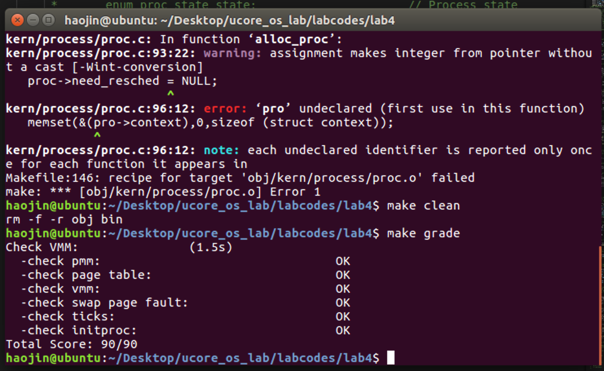

## 实验目的
- 了解内核线程创建/执行的管理过程
- 了解内核线程的切换和基本调度过程

## 实验内容
实验2/3完成了物理和虚拟内存管理，这给创建内核线程（内核线程是一种特殊的进程）打下了提供内存管理的基础。当一个程序加载到内存中运行时，首先通过ucore OS的内存管理子系统分配合适的空间，然后就需要考虑如何分时使用CPU来“并发”执行多个程序，让每个运行的程序（这里用线程或进程表示）“感到”它们各自拥有“自己”的CPU。

本次实验将首先接触的是内核线程的管理。内核线程是一种特殊的进程，内核线程与用户进程的区别有两个：

- 内核线程只运行在内核态
- 用户进程会在在用户态和内核态交替运行
- 所有内核线程共用ucore内核内存空间，不需为每个内核线程维护单独的内存空间
- 而用户进程需要维护各自的用户内存空间
相关原理介绍可看附录B：【原理】进程/线程的属性与特征解析。

## 练习0： 填写已有实验
本实验依赖实验1/2/3。请把你做的实验1/2/3的代码填入本实验中代码中有“LAB1”,“LAB2”,“LAB3”的注释相应部分。

同lab2 3，使用meld即可

## 练习1：分配并初始化一个进程控制块（需要编码）

```c
        proc->state = PROC_UNINIT; // 进程状态
        proc->pid = -1; // 进程ID
        proc->runs = 0; // 进程时间片
        proc->kstack = 0; // 进程所使用的内存栈地址
        proc->need_resched = NULL; // 进程是否能被调度
        proc->parent = NULL; // 父进程
        proc->mm = NULL; // 进程所用的虚拟内存
        memset(&(proc->context), 0, sizeof(struct context)); // 进程的上下文
        proc->tf = NULL; // 中断帧指针
        proc->cr3 = boot_cr3; // 页目录表地址 设为 内核页目录表基址
        proc->flags = 0; // 标志位
        memset(&(proc->name), 0, PROC_NAME_LEN); // 进程名

```
请在实验报告中简要说明你的设计实现过程。请回答如下问题：

- 请说明proc_struct中struct context context和struct trapframe *tf成员变量含义和在本实验中的作用是啥？（提示通过看代码和编程调试可以判断出来）

context作用时在进行上下文切换的过程中，保存当前寄存器的值。其定义在kern/process/proc.h中：

```c
struct context {
    uint32_t eip;
    uint32_t esp;
    uint32_t ebx;
    uint32_t ecx;
    uint32_t edx;
    uint32_t esi;
    uint32_t edi;
    uint32_t ebp;
};

```

trapframe *tf用于记录发生中断之前的栈帧的内容，其中一部分为硬件保存。定义在kern/trap/trap.h中：

```c
struct trapframe {
    struct pushregs tf_regs;
    uint16_t tf_gs;
    uint16_t tf_padding0;
    uint16_t tf_fs;
    uint16_t tf_padding1;
    uint16_t tf_es;
    uint16_t tf_padding2;
    uint16_t tf_ds;
    uint16_t tf_padding3;
    uint32_t tf_trapno;
    /* below here defined by x86 hardware */
    uint32_t tf_err;
    uintptr_t tf_eip;
    uint16_t tf_cs;
    uint16_t tf_padding4;
    uint32_t tf_eflags;
    /* below here only when crossing rings, such as from user to kernel */
    uintptr_t tf_esp;
    uint16_t tf_ss;
    uint16_t tf_padding5;
} __attribute__((packed));
```
## 练习2：为新创建的内核线程分配资源（需要编码）

创建一个内核线程需要分配和设置好很多资源。kernel_thread函数通过调用do_fork函数完成具体内核线程的创建工作。do_kernel函数会调用alloc_proc函数来分配并初始化一个进程控制块，但alloc_proc只是找到了一小块内存用以记录进程的必要信息，并没有实际分配这些资源。ucore一般通过do_fork实际创建新的内核线程。do_fork的作用是，创建当前内核线程的一个副本，它们的执行上下文、代码、数据都一样，但是存储位置不同。在这个过程中，需要给新内核线程分配资源，并且复制原进程的状态。你需要完成在kern/process/proc.c中的do_fork函数中的处理过程。它的大致执行步骤包括：

- 调用alloc_proc，首先获得一块用户信息块。
- 为进程分配一个内核栈。
- 复制原进程的内存管理信息到新进程（但内核线程不必做此事）
- 复制原进程上下文到新进程
- 将新进程添加到进程列表
- 唤醒新进程
- 返回新进程号



请在实验报告中简要说明你的设计实现过程。请回答如下问题：

- 请说明ucore是否做到给每个新fork的线程一个唯一的id？请说明你的分析和理由。

## 练习3：阅读代码，理解 proc_run 函数和它调用的函数如何完成进程切换的。（无编码工作）
请在实验报告中简要说明你对proc_run函数的分析。并回答如下问题：

```c
当前进程/线程 切换到 proc 这个进程/线程
void proc_run(struct proc_struct *proc) {
    if (proc != current) {
        bool intr_flag;
        struct proc_struct *prev = current, *next = proc;
        local_intr_save(intr_flag); // 关闭中断
        {
            current = proc; // 将当前进程换为 要切换到的进程
            // 设置任务状态段tss中的特权级0下的 esp0 指针为 next 内核线程 的内核栈的栈顶
            load_esp0(next->kstack + KSTACKSIZE);
            lcr3(next->cr3); // 重新加载 cr3 寄存器(页目录表基址) 进行进程间的页表切换
            switch_to(&(prev->context), &(next->context)); // 调用 switch_to 进行上下文的保存与切换
        }
        local_intr_restore(intr_flag);
    }
}
```


在本实验的执行过程中，创建且运行了几个内核线程？

两个内核线程 一个为 idle_proc 为 第 0 个内核线程 完成内核中的初始化 然后调度执行其他进程或线程
另一个为 init_proc 本次实验的内核线程 只用来打印字符串

语句local_intr_save(intr_flag);....local_intr_restore(intr_flag);在这里有何作用?请说明理由

关闭中断 避免进程切换的中途 再被中断(其他进程再进行调度)

完成代码编写后，编译并运行代码：make qemu

```shell
WARNING: Image format was not specified for 'bin/ucore.img' and probing guessed raw.
         Automatically detecting the format is dangerous for raw images, write operations on block 0 will be restricted.
         Specify the 'raw' format explicitly to remove the restrictions.
WARNING: Image format was not specified for 'bin/swap.img' and probing guessed raw.
         Automatically detecting the format is dangerous for raw images, write operations on block 0 will be restricted.
         Specify the 'raw' format explicitly to remove the restrictions.
(THU.CST) os is loading ...

Special kernel symbols:
  entry  0xc0100036 (phys)
  etext  0xc0109614 (phys)
  edata  0xc0127000 (phys)
  end    0xc012a160 (phys)
Kernel executable memory footprint: 169KB
The value of ebp:0xc0123f48 eip:0xc0100a89 arg:0xc0123f50  0xc0123f54  0xc0123f58  0xc0123f5c  
    kern/debug/kdebug.c:309: print_stackframe+21
The value of ebp:0xc0123f58 eip:0xc0100d97 arg:0xc0123f60  0xc0123f64  0xc0123f68  0xc0123f6c  
    kern/debug/kmonitor.c:129: mon_backtrace+10
The value of ebp:0xc0123f78 eip:0xc01000cc arg:0xc0123f80  0xc0123f84  0xc0123f88  0xc0123f8c  
    kern/init/init.c:58: grade_backtrace2+19
The value of ebp:0xc0123f98 eip:0xc01000ee arg:0xc0123fa0  0xc0123fa4  0xc0123fa8  0xc0123fac  
    kern/init/init.c:63: grade_backtrace1+27
The value of ebp:0xc0123fb8 eip:0xc010010b arg:0xc0123fc0  0xc0123fc4  0xc0123fc8  0xc0123fcc  
    kern/init/init.c:68: grade_backtrace0+19
The value of ebp:0xc0123fd8 eip:0xc010012c arg:0xc0123fe0  0xc0123fe4  0xc0123fe8  0xc0123fec  
    kern/init/init.c:73: grade_backtrace+26
The value of ebp:0xc0123ff8 eip:0xc0100086 arg:0xc0124000  0xc0124004  0xc0124008  0xc012400c  
    kern/init/init.c:33: kern_init+79
memory management: default_pmm_manager
e820map:
  memory: 0009fc00, [00000000, 0009fbff], type = 1.
  memory: 00000400, [0009fc00, 0009ffff], type = 2.
  memory: 00010000, [000f0000, 000fffff], type = 2.
  memory: 07ee0000, [00100000, 07fdffff], type = 1.
  memory: 00020000, [07fe0000, 07ffffff], type = 2.
  memory: 00040000, [fffc0000, ffffffff], type = 2.
check_alloc_page() succeeded!
check_pgdir() succeeded!
check_boot_pgdir() succeeded!
-------------------- BEGIN --------------------
PDE(0e0) c0000000-f8000000 38000000 urw
  |-- PTE(38000) c0000000-f8000000 38000000 -rw
PDE(001) fac00000-fb000000 00400000 -rw
  |-- PTE(000e0) faf00000-fafe0000 000e0000 urw
  |-- PTE(00001) fafeb000-fafec000 00001000 -rw
--------------------- END ---------------------
use SLOB allocator
kmalloc_init() succeeded!
check_vma_struct() succeeded!
page fault at 0x00000100: K/W [no page found].
check_pgfault() succeeded!
check_vmm() succeeded.
ide 0:      10000(sectors), 'QEMU HARDDISK'.
ide 1:     262144(sectors), 'QEMU HARDDISK'.
SWAP: manager = fifo swap manager
BEGIN check_swap: count 1, total 31954
setup Page Table for vaddr 0X1000, so alloc a page
setup Page Table vaddr 0~4MB OVER!
set up init env for check_swap begin!
page fault at 0x00001000: K/W [no page found].
page fault at 0x00002000: K/W [no page found].
page fault at 0x00003000: K/W [no page found].
page fault at 0x00004000: K/W [no page found].
set up init env for check_swap over!
write Virt Page c in fifo_check_swap
write Virt Page a in fifo_check_swap
write Virt Page d in fifo_check_swap
write Virt Page b in fifo_check_swap
write Virt Page e in fifo_check_swap
page fault at 0x00005000: K/W [no page found].
main-loop: WARNING: I/O thread spun for 1000 iterations
swap_out: i 0, store page in vaddr 0x1000 to disk swap entry 2
write Virt Page b in fifo_check_swap
write Virt Page a in fifo_check_swap
page fault at 0x00001000: K/W [no page found].
swap_out: i 0, store page in vaddr 0x2000 to disk swap entry 3
swap_in: load disk swap entry 2 with swap_page in vadr 0x1000
write Virt Page b in fifo_check_swap
page fault at 0x00002000: K/W [no page found].
swap_out: i 0, store page in vaddr 0x3000 to disk swap entry 4
swap_in: load disk swap entry 3 with swap_page in vadr 0x2000
write Virt Page c in fifo_check_swap
page fault at 0x00003000: K/W [no page found].
swap_out: i 0, store page in vaddr 0x4000 to disk swap entry 5
swap_in: load disk swap entry 4 with swap_page in vadr 0x3000
write Virt Page d in fifo_check_swap
page fault at 0x00004000: K/W [no page found].
swap_out: i 0, store page in vaddr 0x5000 to disk swap entry 6
swap_in: load disk swap entry 5 with swap_page in vadr 0x4000
write Virt Page e in fifo_check_swap
page fault at 0x00005000: K/W [no page found].
swap_out: i 0, store page in vaddr 0x1000 to disk swap entry 2
swap_in: load disk swap entry 6 with swap_page in vadr 0x5000
write Virt Page a in fifo_check_swap
page fault at 0x00001000: K/R [no page found].
swap_out: i 0, store page in vaddr 0x2000 to disk swap entry 3
swap_in: load disk swap entry 2 with swap_page in vadr 0x1000
count is 0, total is 5
check_swap() succeeded!
++ setup timer interrupts
this initproc, pid = 1, name = "init"
To U: "Hello world!!".
To U: "en.., Bye, Bye. :)"
kernel panic at kern/process/proc.c:348:
    process exit!!.

stack trackback:
The value of ebp:0xc030dfa8 eip:0xc0100a89 arg:0xc030dfb0  0xc030dfb4  0xc030dfb8  0xc030dfbc  
    kern/debug/kdebug.c:309: print_stackframe+21
The value of ebp:0xc030dfc8 eip:0xc010045c arg:0xc030dfd0  0xc030dfd4  0xc030dfd8  0xc030dfdc  
    kern/debug/panic.c:27: __panic+107
The value of ebp:0xc030dfe8 eip:0xc01086f1 arg:0xc030dff0  0xc030dff4  0xc030dff8  0xc030dffc  
    kern/process/proc.c:348: do_exit+28
Welcome to the kernel debug monitor!!
Type 'help' for a list of commands.
```

## 扩展练习Challenge：实现支持任意大小的内存分配算法
