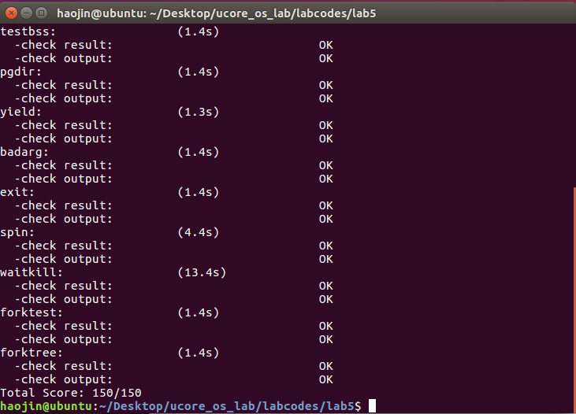

## 实验目的
- 了解第一个用户进程创建过程
- 了解系统调用框架的实现机制
- 了解ucore如何实现系统调用sys_fork/sys_exec/sys_exit/sys_wait来进行进程管理

## 实验内容
实验4完成了内核线程，但到目前为止，所有的运行都在内核态执行。实验5将创建用户进程，让用户进程在用户态执行，且在需要ucore支持时，可通过系统调用来让ucore提供服务。为此需要构造出第一个用户进程，并通过系统调用sys_fork/sys_exec/sys_exit/sys_wait来支持运行不同的应用程序，完成对用户进程的执行过程的基本管理。相关原理介绍可看附录B。

### 实验0
本实验依赖实验1/2/3/4。请把你做的实验1/2/3/4的代码填入本实验中代码中有“LAB1”/“LAB2”/“LAB3”/“LAB4”的注释相应部分。注意：为了能够正确执行lab5的测试应用程序，可能需对已完成的实验1/2/3/4的代码进行进一步改进。

用meld完成同样的步骤

修改部分如下:

```c
proc.c: 
static struct proc_struct * alloc_proc(void) {
    proc->state = PROC_UNINIT;
    proc->pid = -1;
    proc->runs = 0;
    proc->kstack = 0;
    proc->need_resched = NULL;
    proc->parent = NULL;
    proc->mm = NULL;
    memset(&(proc->context), 0, sizeof(struct context));
    proc->tf = NULL;
    proc->cr3 = boot_cr3;
    proc->flags = 0;
    memset(&(proc->name), 0, PROC_NAME_LEN);


    // 新添加: 初始化进程等待状态 初始化进程相关指针
    proc->wait_state = 0; 
    proc->cptr = proc->yptr = proc-> optr = NULL;
    |   cptr: proc is parent          |
    |   yptr: proc is younger sibling |
    |   optr: proc is older sibling   |
}
int do_fork(uint32_t clone_flags, uintptr_t stack, struct trapframe *tf) {
    if ((proc = alloc_proc()) == NULL) {
        goto fork_out;
    }
    proc->parent = current;

    // 添加这行 确保 当前进程正在等待    
    assert(current->wait_state == 0);

    if (setup_kstack(proc) != 0) {
        goto bad_fork_cleanup_proc;
    }
    if (copy_mm(clone_flags, proc) != 0) {
        goto bad_fork_cleanup_kstack;
    }
    copy_thread(proc, stack, tf);
    bool intr_flag;
    local_intr_save(intr_flag);
    {
        proc->pid = get_pid();
        hash_proc(proc);

        // 删除此行 nr_process++ 和 加入链表那行 添加下面那行;
        // 将原来的简单 计数 改成设置进程的相关链接
        set_links(proc);
    }
    local_intr_restore(intr_flag);

    wakeup_proc(proc);
    ret = proc->pid;
}

trap.c:
static void trap_dispatch(struct trapframe *tf) {
    // 时间片用完 设置进程 为 需要被调度
    if (++ticks % TICK_NUM == 0) {
        assert(current != NULL);
        current->need_resched = 1;
    }
}
void idt_init(void) {
    int i;
    for (i = 0; i < sizeof(idt) / sizeof(struct gatedesc); i++) {
        SETGATE(idt[i], 0, GD_KTEXT, __vectors[i], DPL_KERNEL);
    }
    // 添加下面这行
    // 设置给用户态用的中断门 让用户态能够进行系统调用
    SETGATE(idt[T_SYSCALL], 1, GD_KTEXT, __vectors[T_SYSCALL], DPL_USER);

    lidt(&idt_pd);
}
```

### 练习1: 加载应用程序并执行（需要编码）
do_execv函数调用load_icode（位于kern/process/proc.c中）来加载并解析一个处于内存中的ELF执行文件格式的应用程序，建立相应的用户内存空间来放置应用程序的代码段、数据段等，且要设置好proc_struct结构中的成员变量trapframe中的内容，确保在执行此进程后，能够从应用程序设定的起始执行地址开始执行。需设置正确的trapframe内容。

请在实验报告中简要说明你的设计实现过程。

```c
首先清空进程原先的中断帧 然后再将 中断帧中的 代码段 和 数据段
修改为 用户态的段选择子 栈指针设置为 用户栈顶 eip 设置为 用户程序的入口地址
最后 确保在用户进程中能够响应中断
static int load_icode(unsigned char *binary, size_t size) {
    tf->tf_cs = USER_CS;
    tf->tf_ds = tf->tf_es = tf->tf_ss = USER_DS;
    tf->tf_esp = USTACKTOP;
    tf->tf_eip = elf->e_entry;
    tf->tf_eflags = FL_IF;
}

```

请在实验报告中描述当创建一个用户态进程并加载了应用程序后，CPU是如何让这个应用程序最终在用户态执行起来的。即这个用户态进程被ucore选择占用CPU执行（RUNNING态）到具体执行应用程序第一条指令的整个经过。

在此之前先理一下 用户态进程是怎么来的

- 创建了一个 硬构造了 第0个 内核线程 idleproc
- idleproc 通过 kernel_thread 创建了 第1个内核线程 initproc 在 lab 4 中只是打印字符串
- initproc 通过 kernel_execve 将 hello应用程序执行码覆盖到了 initproc 用户虚拟内存空间 来创建 用户态进程

	创建一个用户态进程并加载了应用程序之后 调度器 schedule 调用 proc_run
	设置 指针 current 为当前执行PCB 并加载 该进程的 内核栈和页目录表
	调用 switch_to 因为 当前进程的 context 其中的 eip 被设置为 forkret(copy_thread 拷贝父进程的中断帧时设置的) 因此 switch_to ret 后
	会跳转到 forkret 处 forkret 又会 将栈 设置为 当前进程的trapframe 然后跳到 __trapret
	此时 __trapret 会根据当前进程的trapframe 恢复上下文 最后 退出中断 iret 从系统调用的函数调用路径 返回
	切换到用户进程 hello 第一句语句 _start 处 开始执行
	
	

### 练习2: 父进程复制自己的内存空间给子进程（需要编码）

创建子进程的函数do_fork在执行中将拷贝当前进程（即父进程）的用户内存地址空间中的合法内容到新进程中（子进程），完成内存资源的复制。具体是通过copy_range函数（位于kern/mm/pmm.c中）实现的，请补充copy_range的实现，确保能够正确执行。

```c
/* LAB5:EXERCISE2 YOUR CODE
         * replicate content of page to npage, build the map of phy addr of nage with the linear addr start
         *
         * Some Useful MACROs and DEFINEs, you can use them in below implementation.
         * MACROs or Functions:
         *    page2kva(struct Page *page): return the kernel vritual addr of memory which page managed (SEE pmm.h)
         *    page_insert: build the map of phy addr of an Page with the linear addr la
         *    memcpy: typical memory copy function
         *
         * (1) find src_kvaddr: the kernel virtual address of page
         * (2) find dst_kvaddr: the kernel virtual address of npage
         * (3) memory copy from src_kvaddr to dst_kvaddr, size is PGSIZE
         * (4) build the map of phy addr of  nage with the linear addr start
         */
这个函数是用来 拷贝父进程的用户内存地址空间到子进程中 share 此处没用到 不管它
int copy_range(pde_t *to, pde_t *from, uintptr_t start, uintptr_t end, bool share) {
    // 找到父进程的 页虚拟内存地址 和 子进程的 页虚拟内存地址 将 父进程的页 拷贝到 子进程的页
    void* src_kvaddr = page2kva(page);
    void* dst_kvaddr = page2kva(npage);
    memcpy(dst_kvaddr, src_kvaddr, PGSIZE);
    ret = page_insert(to, npage, start, perm);
}
```

Copy-on-write（简称COW）的基本概念是指如果有多个使用者对一个资源A（比如内存块）进行读操作，则每个使用者只需获得一个指向同一个资源A的指针，就可以该资源了。若某使用者需要对这个资源A进行写操作，系统会对该资源进行拷贝操作，从而使得该“写操作”使用者获得一个该资源A的“私有”拷贝—资源B，可对资源B进行写操作。该“写操作”使用者对资源B的改变对于其他的使用者而言是不可见的，因为其他使用者看到的还是资源A。

### 练习3: 阅读分析源代码，理解进程执行 fork/exec/wait/exit 的实现，以及系统调用的实现（不需要编码）

请在实验报告中简要说明你对 fork/exec/wait/exit函数的分析。并回答如下问题：

- 请分析fork/exec/wait/exit在实现中是如何影响进程的执行状态的？

	fork 创建新的 PCB 进程状态为 UNINIT
	exec 将当前进程的内存布局清除 再调用 load_icode 读出 ELF映像中的内存布局 并填写 进程状态不改变
	wait 当前进程若无子进程 则返回错误 若有子进程 则判定 是否为 ZOMBIE 子进程 有则释放子进程的资源 并返回子进程的返回状态码
	若无 ZOMBIE 状态子进程 则进入 SLEEPING 状态 等子进程唤醒
	exit 清除当前进程几乎所有资源(PCB和内核栈不清除) 将所有子进程(如果有的话)设置为 init 进程(内核) 将当前进程状态设置为 ZOMBIE
	若有父进程在等待当前进程exit 则 唤醒父进程
	
- 请给出ucore中一个用户态进程的执行状态生命周期图（包执行状态，执行状态之间的变换关系，以及产生变换的事件或函数调用）。（字符方式画即可）

```
                                             RUNNING----------------+
                                               A |                  |
                                               | |                  |
                                            proc_run()            exit()  
                                               | |                  |
                                               | V                  V
--alloc_page()--> UNINIT --wakeup_proc()--> RUNNABLE --exit()--> ZOMBIE
                                               A                    A
                                               |                    |
                                           子进程exit()            exit()
                                               |                    |
                                               |                    |
                                            SLEEPING----------------+

```

执行：make grade。如果所显示的应用程序检测都输出ok，则基本正确。（使用的是qemu-1.0.1）


### 扩展练习 Challenge ：实现 Copy on Write 机制

给出实现源码和设计报告。

这个扩展练习涉及到本实验和上一个实验“虚拟内存管理”。在ucore操作系统中，当一个用户父进程创建自己的子进程时，父进程会把其申请的用户空间设置为只读，子进程可共享父进程占用的用户内存空间中的页面（这就是一个共享的资源）。当其中任何一个进程修改此用户内存空间中的某页面时，ucore会通过page fault异常获知该操作，并完成拷贝内存页面，使得两个进程都有各自的内存页面。这样一个进程所做的修改不会被另外一个进程可见了。请在ucore中实现这样的COW机制。
 