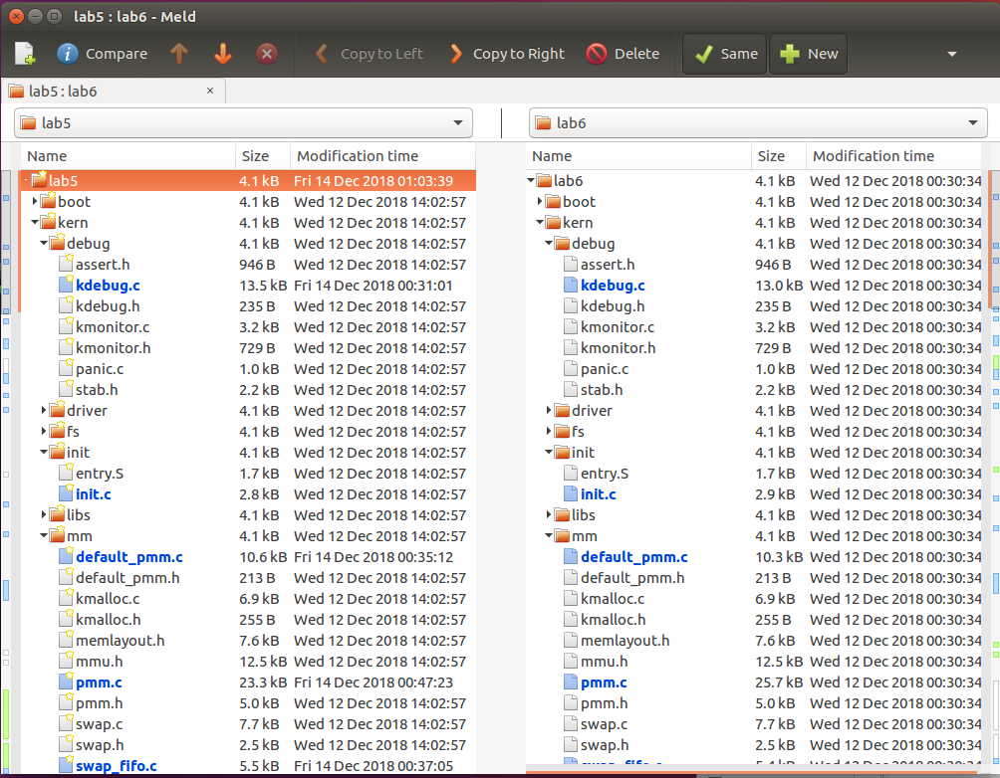
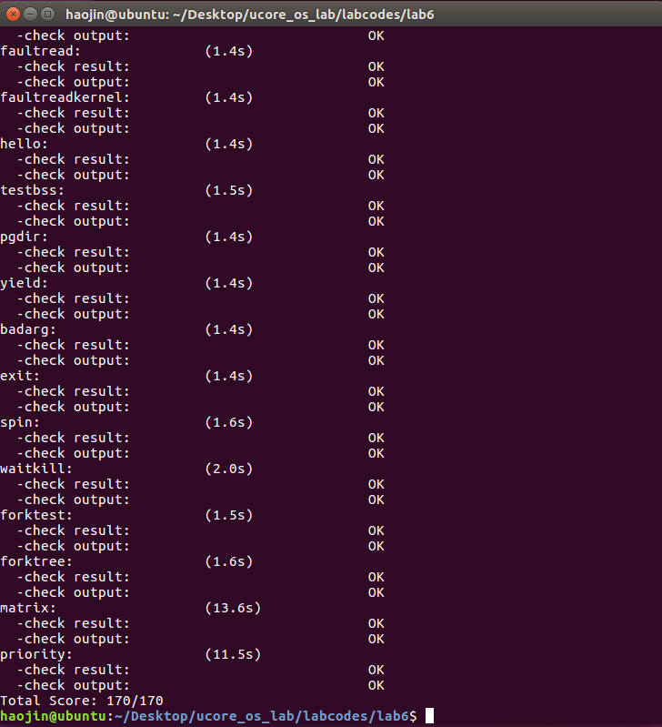

## 实验目的
- 理解操作系统的调度管理机制
- 熟悉 ucore 的系统调度器框架，以及缺省的Round-Robin 调度算法
- 基于调度器框架实现一个(Stride Scheduling)调度算法来替换缺省的调度算法

## 实验内容
实验五完成了用户进程的管理，可在用户态运行多个进程。但到目前为止，采用的调度策略是很简单的FIFO调度策略。本次实验，主要是熟悉ucore的系统调度器框架，以及基于此框架的Round-Robin（RR） 调度算法。然后参考RR调度算法的实现，完成Stride Scheduling调度算法。

### 练习0：填写已有实验
本实验依赖实验1/2/3/4/5/6。请把你做的实验1/2/3/4/5/6的代码填入本实验中代码中有“LAB1”/“LAB2”/“LAB3”/“LAB4”/“LAB5”/“LAB6”的注释相应部分。并确保编译通过。注意：为了能够正确执行lab7的测试应用程序，可能需对已完成的实验1/2/3/4/5/6的代码进行进一步改进。

同前面lab，用meld进行代码合并

修改代码如下

```c
// alloc_proc - alloc a proc_struct and init all fields of proc_struct
static struct proc_struct *
alloc_proc(void) {
    struct proc_struct *proc = kmalloc(sizeof(struct proc_struct));
    if (proc != NULL) {
    //LAB4:EXERCISE1 YOUR CODE
    /*
     * below fields in proc_struct need to be initialized
     *       enum proc_state state;                      // Process state
     *       int pid;                                    // Process ID
     *       int runs;                                   // the running times of Proces
     *       uintptr_t kstack;                           // Process kernel stack
     *       volatile bool need_resched;                 // bool value: need to be rescheduled to release CPU?
     *       struct proc_struct *parent;                 // the parent process
     *       struct mm_struct *mm;                       // Process's memory management field
     *       struct context context;                     // Switch here to run process
     *       struct trapframe *tf;                       // Trap frame for current interrupt
     *       uintptr_t cr3;                              // CR3 register: the base addr of Page Directroy Table(PDT)
     *       uint32_t flags;                             // Process flag
     *       char name[PROC_NAME_LEN + 1];               // Process name
     */
     //LAB5 YOUR CODE : (update LAB4 steps)
    /*
     * below fields(add in LAB5) in proc_struct need to be initialized    
     *       uint32_t wait_state;                        // waiting state
     *       struct proc_struct *cptr, *yptr, *optr;     // relations between processes
     */
     //LAB6 YOUR CODE : (update LAB5 steps)
    /*
     * below fields(add in LAB6) in proc_struct need to be initialized
     *     struct run_queue *rq;                       // running queue contains Process
     *     list_entry_t run_link;                      // the entry linked in run queue
     *     int time_slice;                             // time slice for occupying the CPU
     *     skew_heap_entry_t lab6_run_pool;            // FOR LAB6 ONLY: the entry in the run pool
     *     uint32_t lab6_stride;                       // FOR LAB6 ONLY: the current stride of the process
     *     uint32_t lab6_priority;                     // FOR LAB6 ONLY: the priority of process, set by lab6_set_priority(uint32_t)
     */
        proc->state = PROC_UNINIT;//设置进程为未初始化状态
        proc->pid = -1;          //未初始化的进程id=-1
        proc->runs = 0;          //初始化时间片
        proc->kstack = 0;      //初始化内存栈的地址
        proc->need_resched = 0;   //是否需要调度设为不需要
        proc->parent = NULL;      //置空父节点
        proc->mm = NULL;      //置空虚拟内存
        memset(&(proc->context), 0, sizeof(struct context));//初始化上下文
        proc->tf = NULL;      //中断帧指针设置为空
        proc->cr3 = boot_cr3;      //页目录设为内核页目录表的基址
        proc->flags = 0;      //初始化标志位
        memset(proc->name, 0, PROC_NAME_LEN);//置空进程名
        proc->wait_state = 0;  //初始化进程等待状态  
        //*cptr-->children | *yptr-->younger | *optr-->older 
        proc->cptr=proc->yptr=proc->optr = NULL;//进程相关指针初始化  
        proc->rq = NULL;//置运行队列为空
        //该进程的调度链表结构，该结构内部的链接组成了运行队列列表
        list_init(&(proc->run_link));//初始化运行队列的指针
        //该进程剩余的时间片，只对当前进程有效
        proc->time_slice = 0;//初始化时间片
        //该进程在优先队列中的节点，仅在lab6中使用
        proc->lab6_run_pool.left = proc->lab6_run_pool.right = proc->lab6_run_pool.parent = NULL; //初始化各类指针为空
        //该进程的调度步进值，仅在lab6中使用
        proc->lab6_stride = 0;//初始化当前运行步数
        //该进程的调度优先级，仅在lab6中使用
        proc->lab6_priority = 0;//初始化优先级
    }
    return proc;
}
```


## 练习1: 使用 Round Robin 调度算法（不需要编码）

完成练习0后，建议大家比较一下（可用kdiff3等文件比较软件）个人完成的lab5和练习0完成后的刚修改的lab6之间的区别，分析了解lab6采用RR调度算法后的执行过程。执行make grade，大部分测试用例应该通过。但执行priority.c应该过不去。

请在实验报告中完成：

- 请理解并分析sched_calss中各个函数指针的用法，并接合Round Robin 调度算法描ucore的调度执行过程

让所有runnable态的进程分时轮流使用CPU时间。RR调度器维护当前runnable进程的有序运行队列。当前进程的时间片用完之后，调度器将当前进程放置到运行队列的尾部，再从其头部取出进程进行调度。 

  RR调度算法的就绪队列在组织结构上也是一个双向链表，只是增加了一个成员变量，表明在此就绪进程队列中的最大执行时间片。而且在进程控制块proc_struct中增加了一个成员变量time_slice，用来记录进程当前的可运行时间片段。这是由于RR调度算法需要考虑执行进程的运行时间不能太长。在每个timer到时的时候，操作系统会递减当前执行进程的time_slice，当time_slice为0时，就意味着这个进程运行了一段时间（这个时间片段称为进程的时间片），需要把CPU让给其他进程执行，于是操作系统就需要让此进程重新回到rq的队列尾，且重置此进程的时间片为就绪队列的成员变量最大时间片max_time_slice值，这表示如果进程在当前的执行时间片已经用完，需要等到下一次有机会运行时，才能再执行一段时间，然后再从rq的队列头取出一个新的进程执行。

### RR_init函数
首先RR_init完成了对进程队列的初始化 
### RR_enqueue函数
它把进程的进程控制块指针放入到rq队列末尾，且如果进程控制块的时间片为0，则需要把它重置为max_time_slice。这表示如果进程在当前的执行时间片已经用完，需要等到下一次有机会运行时，才能再执行一段时间。然后在依次调整rq和rq的进程数目加

###RR_dequeue函数
把就绪进程队列rq的进程控制块指针的队列元素删除，并把表示就绪进程个数的proc_num减一。
### RR_pick_next函数
选取函数，即选取就绪进程队列rq中的队头队列元素，并把队列元素转换成进程控制块指针。

- 请在实验报告中简要说明如何设计实现”多级反馈队列调度算法“，给出概要设计，鼓励给出详细设计

### RR_proc_tick函数
即每一次时间片到时的时候，当前执行进程的时间片time_slice便减一。如果time_slice降到零，则设置此进程成员变量need_resched标识为1，设置为需要调度，这样在下一次中断来后执行trap函数时，会执行schedule函数，然后把当前执行进程放回就绪队列末尾，而从就绪队列头取出等待时间最久的那个就绪进程执行。 


### default_sched_class
定义一个c语言类的实现，提供调度算法的切换接口 

## 练习2: 实现 Stride Scheduling 调度算法（需要编码）

首先需要换掉RR调度器的实现，即用default_sched_stride_c覆盖default_sched.c。然后根据此文件和后续文档对Stride度器的相关描述，完成Stride调度算法的实现。

首先，根据的要求覆盖掉Round Robin调度算法。 
覆盖掉之后需要在该框架上实现Stride Scheduling调度算法。
  
1、为每个runnable的进程设置一个当前状态stride，表示该进程当前的调度权。另外定义其对应的pass值，表示对应进程在调度后，stride 需要进行的累加值。
2、每次需要调度时，从当前 runnable 态的进程中选择 stride最小的进程调度。对于获得调度的进程P，将对应的stride加上其对应的步长pass（只与进程的优先权有关系）。
3、在一段固定的时间之后，回到步骤2，重新调度当前stride最小的进程


### proc_stride_comp_f函数
```c
/* You should define the BigStride constant here*/  
/* LAB6: YOUR CODE */  
#define BIG_STRIDE    0x7FFFFFFF /* 定义一个大整数处以优先级 */  

/* The compare function for two skew_heap_node_t's and the 
 * corresponding procs*/  
static int  
proc_stride_comp_f(void *a, void *b)  
{  
     struct proc_struct *p = le2proc(a, lab6_run_pool);  
     struct proc_struct *q = le2proc(b, lab6_run_pool);  
     int32_t c = p->lab6_stride - q->lab6_stride;//步数相减，通过正负比较大小关系  
     if (c > 0) return 1;  
     else if (c == 0) return 0;  
     else return -1;  
}

```
### stride_init函数
首先初始化调度器类的信息，初始化运行队列为一个空的容器结构，然后设置当前运行队列内进程数目为0。

```c
/*
 * stride_init initializes the run-queue rq with correct assignment for
 * member variables, including:
 *
 *   - run_list: should be a empty list after initialization.
 *   - lab6_run_pool: NULL
 *   - proc_num: 0
 *   - max_time_slice: no need here, the variable would be assigned by the caller.
 *
 * hint: see libs/list.h for routines of the list structures.
 */
static void
stride_init(struct run_queue *rq) {
     /* LAB6: YOUR CODE 
      * (1) init the ready process list: rq->run_list
      * (2) init the run pool: rq->lab6_run_pool
      * (3) set number of process: rq->proc_num to 0       
      */
    list_init(&(rq->run_list));//初始化调度器类的信息  
    rq->lab6_run_pool = NULL;//初始化当前的运行队列为一个空的容器结构。  
    rq->proc_num = 0;//设置rq->proc_num为 0  
}
```

### stride_enqueue函数
初始化刚进入运行队列的进程proc的stride属性。
比较队头元素与当前进程的步数大小，选择步数最小的运行，将proc插入放入运行队列中去（注意：这里并不要求放置在队列头部）。
最后初始化时间片，然后将运行队列进程数目加一。

```c
/* 
 * stride_enqueue inserts the process ``proc'' into the run-queue 
 * ``rq''. The procedure should verify/initialize the relevant members 
 * of ``proc'', and then put the ``lab6_run_pool'' node into the 
 * queue(since we use priority queue here). The procedure should also 
 * update the meta date in ``rq'' structure. 
 * 
 * proc->time_slice denotes the time slices allocation for the 
 * process, which should set to rq->max_time_slice. 
 *  
 * hint: see proj13.1/libs/skew_heap.h for routines of the priority 
 * queue structures. 
 */  
static void  
stride_enqueue(struct run_queue *rq, struct proc_struct *proc) {  
    /* LAB6: YOUR CODE */  
    #if USE_SKEW_HEAP  
    //在使用优先队列的实现中表示当前优先队列的头元素
    rq->lab6_run_pool = skew_heap_insert(rq->lab6_run_pool, &(proc->lab6_run_pool), proc_stride_comp_f);//比较队头元素与当前进程的步数大小，选择步数最小的运行  
    #else  
    assert(list_empty(&(proc->run_link)));  
    list_add_before(&(rq->run_list), &(proc->run_link));//将 proc插入放入运行队列中去  
    #endif  
    if (proc->time_slice == 0 || proc->time_slice > rq->max_time_slice) 
    {//初始化时间片  
        proc->time_slice = rq->max_time_slice;  
    }  
    proc->rq = rq;  
    rq->proc_num ++;  
}
```
### stride_dequeue函数
从运行队列中删除相应的元素,完成将一个进程从队列中移除的功能,使用优先队列。最后运行队列数目减一。


```c
/* 
 * stride_dequeue removes the process ``proc'' from the run-queue 
 * ``rq'', the operation would be finished by the skew_heap_remove 
 * operations. Remember to update the ``rq'' structure. 
 * 
 * hint: see proj13.1/libs/skew_heap.h for routines of the priority 
 * queue structures. 
 */  
static void  
stride_dequeue(struct run_queue *rq, struct proc_struct *proc) {  
     /* LAB6: YOUR CODE */  
#if USE_SKEW_HEAP  
     rq->lab6_run_pool =   
          skew_heap_remove(rq->lab6_run_pool, &(proc->lab6_run_pool), proc_stride_comp_f);// 在斜堆中删除相应元素  
#else  
     assert(!list_empty(&(proc->run_link)) && proc->rq == rq);  
     list_del_init(&(proc->run_link));// 从运行队列中删除相应元素  
#endif  
     rq->proc_num --;  
}
```

### stride_pick_next函数
扫描整个运行队列，返回其中stride值最小的对应进程。
更新对应进程的stride值，即pass = BIG_STRIDE / P->priority; P->stride += pass。将步长设置为优先级的倒数，如果为0则设置为最大的步长。

```c
/* 
 * stride_pick_next pick the element from the ``run-queue'', with the 
 * minimum value of stride, and returns the corresponding process 
 * pointer. The process pointer would be calculated by macro le2proc, 
 * see proj13.1/kern/process/proc.h for definition. Return NULL if 
 * there is no process in the queue. 
 * 
 * When one proc structure is selected, remember to update the stride 
 * property of the proc. (stride += BIG_STRIDE / priority) 
 * 
 * hint: see proj13.1/libs/skew_heap.h for routines of the priority 
 * queue structures. 
 */  
static struct proc_struct *  
stride_pick_next(struct run_queue *rq) {  
    /* LAB6: YOUR CODE */  
#if USE_SKEW_HEAP  
    if (rq->lab6_run_pool == NULL) 
    {
        return NULL;  
    }
    //找到相应指针指向rq->lab6_run_pool
    struct proc_struct *p = le2proc(rq->lab6_run_pool, lab6_run_pool);   
#else  
    list_entry_t *le = list_next(&(rq->run_list));  

    if (le == &rq->run_list)  
    {
        return NULL;
    }


    struct proc_struct *p = le2proc(le, run_link);  
    le = list_next(le);  
    while (le != &rq->run_list)  
    {  
        struct proc_struct *q = le2proc(le, run_link);  
        if ((int32_t)(p->lab6_stride - q->lab6_stride) > 0)  
        {
            p = q;  
        }
        le = list_next(le);  
    }  
#endif  
    if (p->lab6_priority == 0)//优先级设置  
    {
        //步长为0则设置为最大步长保持相减的有效性 
        p->lab6_stride += BIG_STRIDE;
    }    
    else 
    {
        //步长设置为优先级的倒数  
        p->lab6_stride += BIG_STRIDE / p->lab6_priority;
    }
    return p;  
}  
```

### stride_proc_tick函数
检测当前进程是否已用完分配的时间片。如果时间片用完，应该正确设置进程结构的相关标记来引起进程切换。
一个* process *最多可以连续运行 rq.max_time_slice个时间片。
具体思想同RR算法思想

```c
/* 
 * stride_proc_tick works with the tick event of current process. You 
 * should check whether the time slices for current process is 
 * exhausted and update the proc struct ``proc''. proc->time_slice 
 * denotes the time slices left for current 
 * process. proc->need_resched is the flag variable for process 
 * switching. 
 */  
static void  
stride_proc_tick(struct run_queue *rq, struct proc_struct *proc) {  
     /* LAB6: YOUR CODE */  
    if (proc->time_slice > 0) 
    {  
        proc->time_slice --;  
    }  
    if (proc->time_slice == 0) 
    {  
        proc->need_resched = 1;  
    }  
}  
```

### default_sched_class
定义一个c语言类的实现，提供调度算法的切换接口

```c

struct sched_class default_sched_class = {  
     .name = "stride_scheduler",  
     .init = stride_init,  
     .enqueue = stride_enqueue,  
     .dequeue = stride_dequeue,  
     .pick_next = stride_pick_next,  
     .proc_tick = stride_proc_tick,  
}; 
```

## 结果
实验1结果：


实验2 结果：


